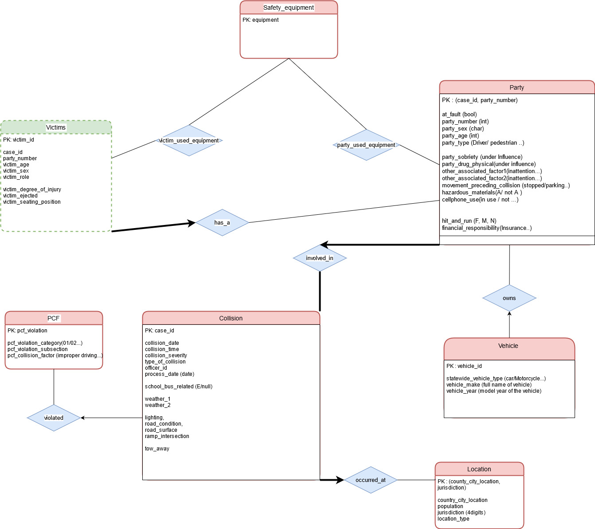

# Deliverable 1 (Group 55)
Authors: Emna Fendri (297286), Antoine Magron (288416) , Stephane Selim (235786)

## ER Diagram

#### <ins>ER Diagram :</ins>

[//]: <> (Displays the ER diagram big enough so that every attributes can be seen properly)
<div jutify-content="center" align-items="center">
    
</div>

#### <ins>Description :</ins>

In this ER diagram we design the structure of our future database. They are 8 entities :

- <ins>Collision :</ins> This entity describe the collision that occured. It has attributes like **collision_date**, **collision_time**, the **collision_type** or whether the collision if **school_bus_related** or not.  A **case_id** is provided and can be the Primary Key of this entity since it's unique for all of them.

- <ins>Party :</ins> This entity describes a party involved in a collision. It contains attributes like **at_fault**, the **party_age** or whether the party is financially responsible or not. The Primary key given with the unique qualifier **party_id**. It's related to Collision thanks to a relation called <span style="color:red">involved_in</span>. In this relation the Parties have a mandatory participation. Indeed if a person is party it means that it was involved in an accident. Moreover a collision needs to have parties so the collision also have a mandatory participation. A party can participate in only one collision so the relation is On-to-Many.


- <ins> Vehicle :</ins> This entity describes the vehicle a party was using during the collision. It's describe by the **statewide_vehicle_type**, **vehicle_make**, and the **vehicle_make**. The Primary key is not given and will have to be generated later. It's relation to a party via the relation <span style="color:red">owns</span>. A party can have at most one vehicle and so the relation is One-to-Many.

- <ins> Victims :</ins> This entity the victims of each parties (can be itself if injured). It already has a Primary key **victim_id** and is described by various attributes like **party_number**, its age, sex, role or **degree_of_injury**. It's involved in a relation <span style="color:red">has_a</span> with Party where it has a participation and key constraint.A victims is always involved in a collision because of a single party. A victim is thus a weak entity of Party.

- <ins> Safety Equipment :</ins> This entity is described only by it's primary key ie. the value of the equipement (a letter). It's in a relation <span style="color:red">party_used_equiment</span> with the Party entity and <span style="color:red">victim_used_equiment</span> with the Victim entity. This is made an entity because the field is present in the two entites. We cannot set any participation constraints here because the fields may be "blank" or "null", ie. the value can be missing.


- <ins> Location :</ins> This entity contains all the attributes that describes the location of the collision. It contains attributes like **county_city_location**, **population**, and **jurisdition**. None of these values are unique, but there combination is. We will have to generate a primary key afterward. It's involved in a One-to-Many relation with Collision in the relation <span style="color:red">occured_at</span>. A collision can only have extacly one (participation constraint as well) location but many collision can occur at the same location. 


- <ins> PCF :</ins> There is a lot of attributes concerning the PCF, and all type of PCF violation like **pcf_violations** or **pcf_collision_factor". We thus decided to put them all in an entity, PCF. The primary key of this entity will be generated later. This entity is involved in a relation with <span style="color:red">violated</span>. A Collision can have at most one link to a instance of PCF. It's thus a one to many relationship. Since all of these attributes can be null the participation from Collision is not mandatory so we cannot set a participation cosntraint.


## Assumptions and constraints

-	A party refers to a person that is directly involved in the accident.
-	Participants of the accident that are not parties are automatically considered as victims. 
-	Each victim is associated to exactly one party. (1-to-N)  
-	Only injured parties are considered as victims. 
-	Many collisions can occur at the same location, but a collision occurs in only one location. (1-to-N)
- A party in a collision may or may not possess one vehicle.
- A collisions may have one pcf violation registered (1-to-N). 

### Translation of ER diagram to relational model
- Tables were created for the above mentioned entities, namely:
*Parties*, *Victims*, *Collisions*, *Locations*, *Vehicles*, *safety_equipments*, *pcf_violations* as well as for the relationships *party_safety_equipment* and *victim_safety_equipment*.

- **Choice between factorizing some attributes into separate entities**: In the initial model, tables were created for *weather* and *conditions*. However we factorized both inside collisions because we don't really need tables for them. Here is the argument for that: let's say we have *conditions* table
with attributes *lighting*, *road_condition*, *road_surface*. If we attribute a unique id to 
each condition entity, we can have redundancies if we have the same exact conditions, but
with different ids, and the goal is to eliminate redundancies. <br>
We can make primary key as (*lighting*, *road_condition*, *road_surface*) to identify a single conditions instance, which the collision
table would have as foreign key to refer to that entity. So the 3 conditions attributes would be included
anyway in the Collision table, and would just refer to an entity in which the only supplementary
information would be the condition id.
So it's best to factor the condition inside the collisions table, which would save space by 
eliminating redundancies, and results in less joins when querying over the data later.

- **Vehicles** denote general model vehicles, and not a specific vehicle attributed to someone. So an idea was to make the primary key a composite one: (*vehicle_make*, *vehicle_year*, *statewide_vehicle_type*), but this means that the party table will have these 3 attributes each time they refer to the same vehicle. A bit of the same dilemna with the aforementioned conditions table. But vehicle models denote unique entities and warrant their own entity table. So an idea is to generate a unique id to each vehicle model. This would have to be done during data loading and not let SQL generate a unique ID, since it will generate differents instances of the same model but with different ids.

- *Parties* is a weak entity of *Collisions*, and *Victims* is a weak entity of *Parties*. So if the strong entity is deleted, the weak is deleted as well.

**Note**: 
- 1-to-many relationships don't need an intermediate table.
- attribute tow_away was first an attribute of *vehicles* but we moved it to *collisions*. After observing the dataset, it seems it's more related to *collisions* to indicate generally whether the tow-truck has been called in or not.


## DDL commands
```
-- Party Table --
-- (Weak entity of COLLISIONS) --
CREATE TABLE PARTIES(
    case_id INTEGER NOT NULL,
    party_number INTEGER NOT NULL,
    at_fault BOOLEAN,
    cellphone_use CHAR(1),
    financial_responsability CHAR(1),
    hazardous_materials CHAR(1),
    movement_preceding_collision CHAR(1),
    other_associated_factor CHAR(1),
    other_associated_factor CHAR(1),
    party_age INTEGER,
    party_sex CHAR(1),
    /* The following two are similar */
    party_drug_physical CHAR(1),
    party_sobriety CHAR(1),
    /* party type is stored as its string value
    (will have to map to corresponding integer in the handout when loading the data) */
    party_type INTEGER,
    vehicle_id INTEGER,
    PRIMARY KEY(case_id, party_number),
    FOREIGN KEY(vehicle_id) REFERENCES VEHICLES,
    FOREIGN KEY(case_id) REFERENCES COLLISIONS ON DELETE CASCADE 
);

-- Collisions Table --
CREATE TABLE COLLISIONS(
    case_id INTEGER NOT NULL,
    -- location
    county_city_location INTEGER,
    jurisdiction INTEGER,
    -- Maybe merge date and time into single attribute?
    collision_date DATE,
    collision_time CHAR(8),
    -- Collision_severity is stored in its string value, should map to its corresponding integer --
    collision_severity INTEGER,
    hit_and_run CHAR(1),
    lighting CHAR(1),
    officer_id INTEGER,
    pcf_violation INTEGER,
    process_date DATE,
    ramp_intersection INTEGER,
    -- Road conditions are stored as their string value, should map to their corresponding integers. --
    road_condition_1 INTEGER,
    road_condition_2 INTEGER,
    road_surface CHAR(10),
    -- tow_away stored as 0,1 or nan --
    tow_away BOOLEAN,
    /* type of collision and both weathers are stored as their string value,
    should map to their corresponding integers in the handout */
    type_of_collision CHAR(1),
    weather_1 CHAR(1),
    weather_2 CHAR(1),
    -- school_bus_related Is either 'E' or blank in the dataset
    school_bus_related BOOLEAN NOT NULL,
    PRIMARY KEY(case_id),
    FOREIGN KEY(pcf_violation) REFERENCES PCF_VIOLATION,
    FOREIGN KEY(county_city_location, jurisdiction) REFERENCES LOCATIONS
);

-- Victims Table --
-- (Weak entity of Parties)
CREATE TABLE VICTIMS(
    id INTEGER NOT NULL,
    case_id INTEGER NOT NULL,
    party_number INTEGER NOT NULL,
    victim_age INTEGER,
    /* degree of injury stored as its string value, should map to its integer 
    counterpart as described in the handout */
    victim_degree_of_injury INTEGER,
    victim_ejected INTEGER,
    victim_role INTEGER,
    victim_seating_position INTEGER, 
    -- stored as 'male', 'female' or nan
    victim_sex CHAR(1),
    PRIMARY KEY (id),
    FOREIGN KEY(case_id, party_number) REFERENCES PARTIES ON DELETE CASCADE
);

-- Safety equipments table --
CREATE TABLE SAFETY_EQUIPMENTS(
    safety_equipment CHAR(1) NOT NULL,
    PRIMARY KEY(safety_equipment)
);


-- Relationship between parties and safety equipments --
CREATE TABLE PARTY_USED_EQUIPMENT(
    case_id INTEGER NOT NULL,
    party_number INTEGER NOT NULL,
    safety_equipment CHAR(1) NOT NULL,
    PRIMARY KEY(case_id, party_number, safety_equipment),
    FOREIGN KEY(case_id, party_number) REFERENCES PARTIES,
    FOREIGN KEY(safety_equipment) REFERENCES SAFETY_EQUIPMENTS
)

-- Relationship between victims and safety equipment --
CREATE TABLE VICTIM_USED_EQUIPMENT(
    victim_id INTEGER NOT NULL,
    safety_equipment CHAR(1) NOT NULL,
    PRIMARY KEY(victim_id, safety_equipment),
    FOREIGN KEY(victim_id) REFERENCES VICTIMS(id),
    FOREIGN KEY(safety_equipment) REFERENCES SAFETY_EQUIPMENTS
)


-- Table for pcf (primary_collision_factor) violation --
CREATE TABLE PCF_VIOLATION(
    pcf_violation INTEGER,
    -- pcf is stored in its string value, consider converting to its 1 char code --
    primary_collision_factor CHAR(1),
    pcf_violation_category CHAR(32),
    pcf_violation_subsection CHAR(1),
    PRIMARY KEY (pcf_violation)
)

-- Locations Table --
CREATE TABLE LOCATIONS(
    county_city_location INTEGER,
    jurisdiction INTEGER, 
    location_type CHAR(1),
    population INTEGER,
    PRIMARY KEY(county_city_location, jurisdiction)
);

-- Vehicles Table --
CREATE TABLE VEHICLES(
    vehicle_id INTEGER,
    statewide_vehicle_type CHAR(1),
    vehicle_make CHAR(1),
    vehicle_year CHAR(1)
    PRIMARY KEY(vehicle_id)
);
```

## General comments

For this deliverable, we first started by defining the ER schema. Each one of us created one in order to merge our work afterward and keep the most convenient ideas according to the data that is given. To create the relational schema from the ER schema we needed to discuss together about some details and made sure that we all agree with the final schema.
