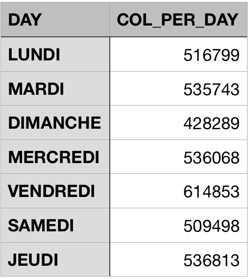
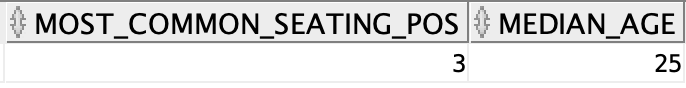

# Deliverable 2

## Updates to ER diagram and DDL

Since last milestone, we've updated our ER diagram and data structure as well as the ddl for creating tables in the database to take into account the feedback given for the 1st deliverable. Some of these changes were also done as a convenience when cleaning and loading the data efficiently and without collisions. Here are some of the changes:


- `locations` has now a uniquely generated id as primary key. During the data preprocesing, we noticed that the (`county_city_location`, `jurisdiction`) pair that we've formerly chosen as primary key for locations, is not a viable candidate. There exists duplicates of them, and storing just the id in the parent table should save a lot of space.

- `pcf violations` has now a uniquely generated id as primary key. During the data preprocesing, we noticed that `pcf_violation` (the primary collision factor numerical code) is not a viable candidate as primary key. We thought that `pcf_violation` would correctly identify all the possible combinations of `primary_collision_factor`, `primary_collision_factor` and `pcf_violation_subsection` that make up the `pcf violations` table, but this was not the case. This should also save a lot of space for the parent table `COLLISIONS` that references `PCF_VIOLATIONS`, by just storing the integer id.

- `weathers` table has now a uniquely generated id as primary key, as well as the actual weather value. So the table only has 7 rows corresponding to the different possible weather values.

- `safety_equipments` has now a uniquely generated id as primary key. But now there is a change in the design choice. Since `Parties` and `Victims` can have 0, 1 or 2 safety equipments, safety_equipments is a now table of the all the possible combinations of two safety equipments (including null, to indicate that only 0 or 1 safety equipment has been used). And for a possible combination, we can refer to this instance using the uniquely generated id.

- We've introduced the new entity `associated_factors`. As with `safety_equipments`, it also has a uniquely generated id as primary key, and its corresponding table lists all the possible combinations of two associated_factors, since `Parties` can have 0, 1 or 2 associated_factors.

- We've also introduced the new entity `road_states`, that lists the conditions of the road on which the collision occurred, such as `lighting` and `road_surface`. It has a uniquely generated id as primary key.

### DDL used for creating the tables in the database

```SQL
DROP TABLE VICTIMS;
DROP TABLE PARTIES;
DROP TABLE COLLISIONS;
DROP TABLE LOCATIONS;
DROP TABLE PCF_VIOLATIONS;
DROP TABLE VEHICLES;
DROP TABLE SAFETY_EQUIPMENTS;
DROP TABLE WEATHERS;
DROP TABLE ROAD_STATES;
DROP TABLE ASSOCIATED_FACTORS;

-- Vehicles Table --
CREATE TABLE VEHICLES(
    vehicle_id INTEGER NOT NULL,
    -- Stored as plain text
    statewide_vehicle_type VARCHAR2(48),
    vehicle_make VARCHAR2(32),
    vehicle_year INTEGER,
    PRIMARY KEY(vehicle_id)
);

ALTER TABLE VEHICLES
   ADD CONSTRAINT vh_uniq UNIQUE (statewide_vehicle_type,
                                  vehicle_make,
                                  vehicle_year);

-- Locations Table --
CREATE TABLE LOCATIONS(
    location_id INTEGER NOT NULL,
    county_city_location INTEGER,
    jurisdiction INTEGER, 
    -- stored as plain text
    location_type VARCHAR2(16),
        CONSTRAINT check_location_type CHECK 
            (location_type IN ('highway', 'intersection', 'ramp')),
    location_population INTEGER 
        CONSTRAINT check_population CHECK (location_population BETWEEN 0 and 9),
    PRIMARY KEY(location_id)
);

ALTER TABLE LOCATIONS
   ADD CONSTRAINT lc_uniq UNIQUE (county_city_location,
                                  jurisdiction,
                                  location_type);

-- Table for pcf (primary_collision_factor) violation --
CREATE TABLE PCF_VIOLATIONS(
    pcf_id INTEGER NOT NULL,
    pcf_violation INTEGER,
    -- stored as plain text 
    primary_collision_factor VARCHAR2(32),
    -- stored as plain text
    pcf_violation_category VARCHAR2(48),
    pcf_violation_subsection CHAR(1),
    PRIMARY KEY(pcf_id)
);

-- Weathers Table --
CREATE TABLE WEATHERS(
    weather_id INTEGER NOT NULL,
    weather VARCHAR2(8) NOT NULL,
    PRIMARY KEY(weather_id)
);

-- Table of combinations of safety equipments
CREATE TABLE SAFETY_EQUIPMENTS(
    seid INTEGER NOT NULL,
    safety_equipment_1 CHAR(1),
    safety_equipment_2 CHAR(1),
    PRIMARY KEY(seid)
);

ALTER TABLE SAFETY_EQUIPMENTS
   ADD CONSTRAINT se_uniq UNIQUE (seid,
                                  safety_equipment_1,
                                  safety_equipment_2);

-- Table of combinations of associated factors
CREATE TABLE ASSOCIATED_FACTORS(
    afid INTEGER NOT NULL,
    associated_factor_1 CHAR(1),
    associated_factor_2 CHAR(1),
    PRIMARY KEY(afid)
);

ALTER TABLE ASSOCIATED_FACTORS
   ADD CONSTRAINT af_uniq UNIQUE (afid,
                                  associated_factor_1,
                                  associated_factor_2);

-- Table for road conditions --
CREATE TABLE ROAD_STATES(
    road_state_id INTEGER NOT NULL,
    -- stored as plain text
    lighting VARCHAR2(48),
    -- stored as plaintext
    road_condition_1 VARCHAR2(32),
    road_condition_2 VARCHAR2(32),
    -- stored as plaintext
    -- CAUTION: watch out for outlier value 'H'
    road_surface VARCHAR2(10),
    PRIMARY KEY (road_state_id)
);

ALTER TABLE ROAD_STATES
    ADD CONSTRAINT rc_uniq UNIQUE (lighting, road_condition_1, road_condition_2, road_surface);

-- Collisions Table --
CREATE TABLE COLLISIONS(
    case_id VARCHAR2(19) NOT NULL, 
    -- location
    location_id INTEGER,  
    -- Maybe merge date and time into single attribute?
    -- All collision date have standard 'yyyy-mm-dd' format.
    collision_date DATE, 
    -- All collision time have standara 'hh-mm-ss' format or just nan 
    -- CAUTION: TIME or DATE?
    collision_time CHAR(8), 
    -- stored as plaintext
    collision_severity VARCHAR2(32)
        CONSTRAINT check_collision_severity CHECK (collision_severity in (
            'property damage only', 'severe injury', 'pain', 'fatal', 'other injury'
        )), 
    -- stored as plain text
    -- CAUTION: outlier value 'D' in data
    hit_and_run VARCHAR2(16) 
        CONSTRAINT check_hit_and_run 
            CHECK (hit_and_run IN ('not hit and run', 'misdemeanor', 'felony')),
    officer_id VARCHAR2(8), 
    pcf_id INTEGER, 
    -- All process date have standard 'yyyy-mm-dd' format.
    process_date DATE, 
    -- Already stored as integer
    ramp_intersection INTEGER 
        CONSTRAINT check_ramp_intersection CHECK (ramp_intersection BETWEEN 1 AND 8),
    road_state_id INTEGER, 
    
    -- tow_away stored as 0,1 or nan --
    tow_away NUMBER(1), 
    -- stored as plaintext
    type_of_collision VARCHAR2(16), 
    weather_id_1 INTEGER, 
    weather_id_2 INTEGER, 
    PRIMARY KEY(case_id),
    FOREIGN KEY(weather_id_1) REFERENCES WEATHERS(weather_id),
    FOREIGN KEY(weather_id_2) REFERENCES WEATHERS(weather_id),
    FOREIGN KEY(road_state_id) REFERENCES ROAD_STATES,
    FOREIGN KEY(pcf_id) REFERENCES PCF_VIOLATIONS,
    FOREIGN KEY(location_id) REFERENCES LOCATIONS
);

-- Party Table --
-- (Weak entity of COLLISIONS) --
CREATE TABLE PARTIES(
    case_id VARCHAR2(19) NOT NULL, 
    party_number INTEGER NOT NULL, 
    -- CAUTION: Named other_associate_factor in the data
    afid INTEGER, 
    at_fault NUMBER(1), 
    -- CAUTION: Can also be one of '1', '2' or '3' 
    cellphone_use CHAR(1) CONSTRAINT check_cellphone_use CHECK (cellphone_use in ('B', 'C', 'D')),
    
    financial_responsibility CHAR(1) CONSTRAINT check_financial_responsibility CHECK(financial_responsibility in ('N', 'Y', 'O', 'E')),
    -- Can be 'A' or blank, need to transform into boolean (0 or 1)
    hazardous_materials NUMBER(1), 
    -- Stored as plain word 
    movement_preceding_collision VARCHAR2(32), 
    party_age INTEGER, 
    -- stored as plain word(TODO: convert to 'M' or 'F')
    party_sex CHAR(1) CONSTRAINT check_party_sex CHECK(party_sex in ('M', 'F')), 
    /* The following two are similar */
    -- CAUTION: outlier value 'G' in data
    party_drug_physical CHAR(1)  
        CONSTRAINT check_party_drug_physical CHECK (party_drug_physical in ('E', 'F', 'H', 'I')),
    party_sobriety CHAR(1) 
        CONSTRAINT check_party_sobriety CHECK (party_sobriety in ('A', 'B', 'C', 'D', 'G', 'H')),
    -- Stored as plain text
    party_type VARCHAR2(16)
        CONSTRAINT check_party_type CHECK (party_type IN (
            'driver', 'parked vehicle', 'other', 'bicyclist', 'pedestrian' 
        )), 
    seid INTEGER, 
    -- CAUTION: school_bus_related Is either 'E' or blank in the dataset, stored in parties
    school_bus_related NUMBER(1), 
    vehicle_id INTEGER, 
    PRIMARY KEY(case_id, party_number),
    FOREIGN KEY(afid) REFERENCES ASSOCIATED_FACTORS,
    FOREIGN KEY(seid) REFERENCES SAFETY_EQUIPMENTS,
    FOREIGN KEY(vehicle_id) REFERENCES VEHICLES,
    FOREIGN KEY(case_id) REFERENCES COLLISIONS ON DELETE CASCADE 
);

-- Victims Table --
-- (Weak entity of Parties)
CREATE TABLE VICTIMS(
    id INTEGER NOT NULL, 
    case_id VARCHAR2(19) NOT NULL, 
    party_number INTEGER NOT NULL, 
    seid INTEGER, 
    victim_age INTEGER, 
        CONSTRAINT check_victim_age CHECK (victim_age BETWEEN 0 AND 999),
    -- stored as plaintext
    -- CAUTION: value '7' should be mapped to 'possible injury'
    victim_degree_of_injury VARCHAR2(32) 
        CONSTRAINT check_victim_degree_of_injury CHECK (victim_degree_of_injury
             IN('no injury', 'severe injury', 'complaint of pain', 'other visible injury', 'killed', 
                'suspected minor injury', 'suspected serious injury', 'possible injury')),
    -- CAUTION: watch out for outlier value 4 --
    victim_ejected INTEGER 
        CONSTRAINT check_victim_ejected CHECK (victim_ejected BETWEEN 0 AND 3),
    victim_role INTEGER 
        CONSTRAINT check_victim_role CHECK (victim_role BETWEEN 1 AND 6),
    victim_seating_position INTEGER 
        CONSTRAINT check_victim_seating_position CHECK (victim_seating_position BETWEEN 0 AND 9), 
    -- stored as plain word(TODO: convert to 'M' or 'F')
    victim_sex CHAR(1) 
        CONSTRAINT check_victim_sex CHECK (victim_sex IN ('M', 'F')),
    PRIMARY KEY (id),
    FOREIGN KEY(seid) REFERENCES SAFETY_EQUIPMENTS,
    FOREIGN KEY(case_id, party_number) REFERENCES PARTIES ON DELETE CASCADE
);

```

The DDL for creating the tables in the database was updated as well to reflect the change in our model. Note that whenever possible and convenient, we added check constraints to control the possible values allowed for columns of the tables, that make sense as per the different values described in the project handout.
For example the `collision_severity` in the `COLLISIONS` table has the following constraint:
```SQL
collision_severity VARCHAR2(32)
        CONSTRAINT check_collision_severity CHECK (collision_severity in (
            'property damage only', 'severe injury', 'pain', 'fatal', 'other injury'
        ))
```

Even after the data preprocessing, this helped us catch some outlier values when trying to insert rows into the db.

We've also added the uniqueness constraints to control the uniqueness of rows in some entities, like `VEHICLES` or `LOCATIONS`, especially since we're generating unique ids for them as primary keys, and we want the other attributes not to repeat. For example:
```SQL
ALTER TABLE VEHICLES
   ADD CONSTRAINT vh_uniq UNIQUE (statewide_vehicle_type,
                                  vehicle_make,
                                  vehicle_year);
```

### Notes:
We chose to refactor some entities (that logically maybe worth having their own table) into attributes of other entities. 

### Case study: Associated factor
- Approach 1: We can choose to create an entity ASSOCIATED_FACTORS, that has the char code of the associated factor as
its primary key. For example: 
```SQL
CREATE TABLE ASSOCIATED_FACTORS(
    associated_factor CHAR(1) NOT NULL,
    PRIMARY KEY(associated_factor)
);
```
This will be a table of 25 rows, corresponding to the different associated factors to a party.
A party can have one or two associated factors, or none. In that case we have a many-to-many relationship, and an intermediate table is needed:
```SQL
CREATE TABLE ASSOCIATED_FACTOR_TO_PARTY(
    associated_factor CHAR(1) NOT NULL,
    -- we consider party_id here an integer for simplicity
    party_id INTEGER NOT NULL,
    PRIMARY KEY(associated_factor, party_id),
    FOREIGN KEY(associated_factor) REFERENCES ASSOCIATED_FACTORS,
    FOREIGN KEY(party_id) REFERENCES PARTIES
)
```

Cons: For every associated factor to a party, there will be a corresponding row in that table and that table can be quite big. And there will be joins to do if we want to query the associated factors. <br>
Pros: When retrieving the associated factors to a party, we won't have to retrieve the whole party data. We just need to query the relation table ASSOCIATED_FACTOR_TO_PARTY.

- Approach 2: We know that parties can have at most 2 other_associated_factors. So we can instead have an entity that summarizes the associated factors to a party:
```SQL
CREATE TABLE ASSOCIATED_FACTORS(
    associated_factors_id INTEGER NOT NULL,
    associated_factor_1 CHAR(1),
    associated_factor_2 CHAR(1)
    PRIMARY KEY(id)
);
```

This table will have all the different combinations of associated factors that a party can have so it will be larger compared to the one we created during the 1st approach (But its size will still be negligible compared to the ASSOCIATED_FACTOR_TO_PARTY relation table of the 1st approach).

This is no longer a many-to-many relationship, instead a 1-to-N. A party can store the id of the particular associated_factors associated to it.

Pros: Significant reduction of the memory used. No need for intermediate table. <br>
Cons: Need for joins during quering when retrieving the associated factors. We will have to get the id of the associated factors from the party, and join with ASSOCIATED_FACTORS.

- Approach 3: 
In this particular case, associated factor is an entity with just one attribute, that happens to be one character ('A', 'B', etc...).
We can just refactor the whole info inside Parties. For example:
```SQL
CREATE TABLE PARTIES(
    party_id INTEGER NOT NULL,
    ...
    associated_factor_1 CHAR(1),
    associated_factor_2 CHAR(1),
    ...
);
```

Thus if we want to check if a party has a certain associated_factor, we have to check associated_factor_1 or associated_factor_2.

Pros: No need for joins during queries. We save space by not having any other tables, all the info is inside the parties. <br>
Cons: If we want to retrieve the associated factors, we will have to retrieve all the parties data to get them. There's also no logical separation of entities, if we deem associated_factor to be worth being its own entity. 

**Final decision**: We chose to go mostly with **approach 2**. As discussed with our TA Vinitra, the actual foreign keys that reference other tables, are somehow lazily evaluated, that is they don't occupy much space unless we use them.

<div class="page"/>

## Data preprocessing and cleaning
For all this part we used the library pandas for python. It offers easy and efficient ways to process a big amount of data coming from CSV files.
The first task was to divide the three CSV files into all the entities we had in the DDL. 

### Create the tables :
We created a new CSV file for the **safety equipment** that stores all the possible tuples of ```safety_equipment_1``` and ```safety_equipment_2``` for both the parties and the victims. Since a victim and a party can have the same tuple it makes sense to have only one table for which we remove the duplicates. We end up we only 475 lines. We also create a new index and put it in the parties' and victims' files. We did the same for the **associate factors** for which there is only 141 rows (except the id goes only in parties). 

For the **weather** we decided to have a small table of only 5 lines containing a generated id, the string of the weather, and the letter (short for the whole string). Then we add in the features ```weather_id_1```, ```weather_id_2``` in the collisions file. We also noted that the values are skewed for these features. Since this data describes the collisions that occurred in California, most of the values for ```(weather_1, weather_2)``` are ```("clear", NaN)```.

We then created the table for the road_state containing the following features : ```road_condition_1```, ```road_condition_2```, ```road_surface```, ```lighting```. Once again we start from 3678063 entries (as stored in collisions) and end up with 690. So we have a good reduction. Also we can see that a lot of entry have this tuple ```(road_condition_1, road_condition_2)``` = ```(normal, NaN)```. This may be due to the fact that this is California (as for the weather) or that the data is entered manually. We then add in collisions a generated ```road_state_id```.

We process the same way for the table vehicle with the feature ```statewide_vehicle_type```, ```vehicle_make```, and ```vehicle_year```. We also put a generated ```vehicle_id``` in parties.

We process the same way for the table location with the feature ```county_city_location```, ```jurisdiction```, ```location_type```, and ```population```. We also put a generated ```location_id``` in collisions.

We process the same way for the table pcf with the feature ```pcf_violation```, ```pcf_violation_category```, ```pcf_violation_subsection```, and ```primary_collisions_factor```. We also put a generated ```pcf_id``` in collisions.

We also decided to drop the ```id``` feature of the parties CSV. Since a party can be fully described by the case_id and the party_number. We nevertheless used it during the preprocessing part.


We had a problem with the feature ```case_id```. For some entries, it's written as a 19 digits integer, which is huge. Due to this, pandas first interpreted it as a ```float64``` which led to collisions for the values due to the float's approximation. Another problem came from the fact that the leading zeros were important and capture information. We could find lines with case_id ```xxxx``` and other lines of the form ```0xxxx```, ```00xxxx```, or ```000xxxx```. So interpreted it as an unsigned integer of 64 bits (```uint64```) was not a solution. We thus decided to interpret it as a VARCHAR of length at most 19.

<div class="page"/>

### Data cleaning (Removing outlier values)
Looking over the data, we've noticed outlier values or malformatted values that stand out among those that we expect for a certain attribute (as described in the project handout). These outliers are most likely due to the fact that entries are entered manually. We chose to replace those values with ```NaN``` since it's often.

We've already added added constraints for some of the attributes when creating the tables in the SQL, to constraint the set of allowable values. However, to avoid error when importing the data, we also chose to handle some of them during preprocessing.

For example:

- `cellphone_use`: can have values 'B', 'C', 'D' as described in the project handout. But in the original dataset, we've noticed also the values '1', '2', '3'. We have mapped the latter to the former ('1' to B, '2' to C, '3' to D). We could have also dropped the numeric values and replaced them with `null`. But we chose the former approach.

- similarly for `victim_degree_of_injury`: we have values like 'no injury' or 'severe injury'. But we noticed the value '7' also, which doesn't figure in the project description. However, we assumed it's an error from whomever put it, and he wanted to put the seventh value from the set of allowable values. In that case, it's 'possible injury'. So we replaced any '7's with 'possible injury'.

- For other attributes like `victim_ejected` (outlier value '4') or `party_drug_physical` (outlier value 'G'), where we could not figure out any logical mapping that goes with what we have in the project handout, we just reverted to the default of replacing them with `NaN` (in pandas) or `null` (in SQL).

- Finally, any attributes that could be interpreted as a `Boolean`, like `school_bus_related` or `hazardous_materials` we converted them to an integer binary value (0 for False, 1 for True). Since Oracle Database doesn't support the `Boolean` datatype, we implemented booleans as `NUMBER(1)`, a single digit binary value.

<div class="page"/>

## Queries
### Query 1 : List the year and the number of collisions per year. 
###### Description : 
From collision table, we group the cases according to the year date. For each year, we count the number of collisions that occurred that particular year. Finally, the `SELECT` clause does a projection and we therefore obtain the 2 columns we are interested in  (year and col_per_year). 


```SQL
SELECT extract(year FROM collision_date) AS year,count(*) AS col_per_year
FROM collisions 
GROUP BY extract(year FROM collision_date);
```


### Query 2 : Find the most popular vehicle make in the database. Also list the number of vehicles of that particular make.
###### Description : 
For this query, we use the `WITH`clause to create a temporary table `Temp`, in which the first column countains all possible vehicle make and the second column corresponds to the number of vehicle per type. From this table, we retrieve the vehicle make that correponds to the most popular one using `MAX()` function.

```SQL
WITH Temp AS 
(   SELECT V.vehicle_make AS vehicle_make ,COUNT(*) AS vehicle_make_count
    FROM parties P, VEHICLES V
    where P.vehicle_id = V.vehicle_id
    GROUP BY V.vehicle_make )

SELECT Temp.vehicle_make, Temp.vehicle_make_count
FROM  Temp
WHERE Temp.vehicle_make_count = (SELECT MAX(Temp.vehicle_make_count) FROM Temp);
```

### Query 3 : Find the fraction of total collisions that happened under dark lighting conditions. 
###### Description :
Dark lighting includes 3 states : 'dark with no street lights' ,'dark with street lights'  and 'dark with street lights not functioning'.
The cross product of tables in the `FROM` list will give another table from which we only select the rows that correspond to collisions that happened under dark lighting conditions. We count the number of these selected rows and divide it by the total number of collisions (the latter being computed in the `WITH` clause).

```SQL
WITH total AS 
(SELECT COUNT(*) AS tot
FROM collisions )

SELECT    ROUND ((SELECT COUNT(*) AS res
            FROM COLLISIONS C , ROAD_STATES R
            WHERE   (C.road_state_id = R.road_state_id) AND ( R.lighting LIKE '%dark%' )
            )/total.tot, 4 ) as fraction_dark_light_col 
                    
FROM total;
```

### Query 4 : Find the number of collisions that have occurred under snowy weather conditions.
###### Description :
The cross product of tables in the `FROM` list will give another table from which we only select the rows that correspond to collisions that happened under snowy weather conditions. We assume that if one of `weather_id_1` or `weather_id_2` (in a collision) mentions a snowy weather, then that particular collision is counted. We use `DISTINCT` in order to avoid counting one collision more than once.

```SQL
SELECT COUNT(DISTINCT c.case_id) AS number_of_snowy_weather_col
FROM COLLISIONS C , WEATHERS W1 , WEATHERS W2 
WHERE  (C.weather_id_1 = W1.weather_id AND W1.weather = 'snowing' )
        OR (C.weather_id_2 = W2.weather_id AND W2.weather = 'snowing' ) ;
```

### Query 5 : Compute the number of collisions per day of the week, and find the day that witnessed the highest number of collisions. List the day along with the number of collisions.
###### Description :
We create a temporary table in which we list the number of collisions per day of the week using the `WITH` clause. From this table, we select the row that corresponds to the day that witnessed the highest number of collisions.

```SQL
--Computes the number of collisions per day of the week
SELECT to_char(COLLISION_DATE, 'DAY') AS day ,COUNT(*) AS col_per_day 
FROM COLLISIONS C
GROUP BY to_char(COLLISION_DATE, 'DAY')
```

```SQL
--Finds the day that witnessed the highest number of collisions
WITH Temp AS 
( SELECT to_char(COLLISION_DATE, 'DAY') AS day ,COUNT(*) AS col_per_day
          FROM COLLISIONS C
          GROUP BY to_char(COLLISION_DATE, 'DAY'))
          
SELECT Temp.day, Temp.col_per_day
FROM Temp
WHERE Temp.col_per_day=(SELECT MAX(Temp.col_per_day) 
                        FROM Temp );
```

### Query 6 :List all weather types and their corresponding number of collisions in descending order of the number of collisions.
###### Description :
In this query we count, for each weather type their corresponding number of collisions.
As each collision has 2 fields mentioning weather conditions, we do this counting a first time with respect to the first field (`weather_id_1`) and a second time with respect to (`weather_id_2`).
Having this, we sum the results of the counting for each weather type. (It is checked that one weather type cannot appear in both fields for the same collision).
NOTE: `weather_id_2` field never refers to a `clear` weather condition, therefore we do a `UNION` showing the counting of `clear` type weather only with respect to `weather_id_1`.
```SQL
with weather1 as (select count(*) as count_w1  , weather as w1
from collisions C , weathers W 
where  C.weather_id_1 = W.weather_id
group by weather ),

weather2 as (select count(*) as count_w2  , weather as w2
from collisions C , weathers W 
where  C.weather_id_2 = W.weather_id
group by weather )

select  weather1.w1 as weathertype ,weather1.count_w1 + weather2.count_w2 as tot
from weather1 , weather2
where (Weather1.w1 = Weather2.w2) 
UNION
select weather1.w1 , weather1.count_w1
from weather1
where weather1.w1 = 'clear'
ORDER BY TOT DESC;
```


### Query 7 :Find the number of at-fault collision parties with financial responsibility and loose material road conditions.
###### Description :
In the `FROM` list we will need the table of `PARTIES` and `COLLISIONS` so that using the `case_id` field, we are able to select the collision in which each party is involved in. Moreover, we will need `ROAD_STATES` table to check the corresponding road state (Natural Join on `road_state_id`).
Finally,this cross product of tables in the `FROM` list will give another table from which we only select the rows in which  we are intrested in, and we count them.

```SQL
SELECT COUNT(*) AS number_of_parties
FROM PARTIES P ,COLLISIONS C , ROAD_STATES R 
WHERE   P.case_id = C.case_id 
        AND C.road_state_id = R.road_state_id
        AND P.at_fault = 1 
        AND P.financial_responsibility = 'Y'
        AND (R.road_condition_1 = 'loose material' OR R.road_condition_2 = 'loose material');
```

### Query 8 :Find the median victim age and the most common victim seating position.
###### Description :
For this query, `temp` is a temporary table in which we list for each seating position the corresponding number of victims, we then select the most commin seating position. We then solve the second part of the query (Find the median victim age) and present them in one row as follows.

```SQL
with temp as (select victim_seating_position as seat , COUNT(*) as count_per_seat
                from victims
                group by victim_seating_position),
q_1  as(
select temp.seat as most_common_seating_pos
from temp 
where temp.count_per_seat = (select max(temp.count_per_seat)from temp ))

select most_common_seating_pos , median_age
from q_1,(select median(V.victim_age)  median_age from victims V );
```



### Query 9 : What is the fraction of all participants that have been victims of collisions while using a belt?
###### Description :
In this query, we assume that "all participants" refers to the total number of victims (computed in `total` within the `WITH` clause).
In the `FROM` list we will need the tables of `VICTIMS` and `SAFETY_EQUIPMENTS` to perform a natural join on `seid` and be able to select the rows we are intrested in (victims of collisions who used a belt).
We compute the number of rows and divide it by the total number of victims to obtain the fraction. We finally round the result to 4 digits.

```SQL
with total as 
(select count(*) as tot
from victims )
                
select round(( SELECT COUNT(*)
        FROM VICTIMS V, SAFETY_EQUIPMENTS S
        WHERE   V.seid = S.seid
                AND (S.safety_equipment_1 = 'C' OR S.safety_equipment_2 = 'C'))/total.tot, 4) as fraction

FROM total;
```

### Query 10 : Compute the fraction of the collisions happening for each hour of the day. Display the ratio as percentage for all the hours of the day.
###### Description :
In the `FROM` list we include a temporary table that lists for each hour of the day the corresponding number collisions. For this step we had to cast `collision_time` as `TIME` to be able to extract the hour of the day.
In the `SELECT` clause, we perform the computation of the percentage (that we round to 4 digits) in each row of this temporary table.

```SQL
with total as 
(select count(*) as tot
from collisions)

select hour,round((count_per_hour/ total.tot)*100, 4) as percentage_per_hour
from total , 
    (select extract( hour from  cast(collision_time as time) ) as hour , count(*) as count_per_hour
    from collisions 
    group by extract(hour from cast(collision_time as time) ));
```

