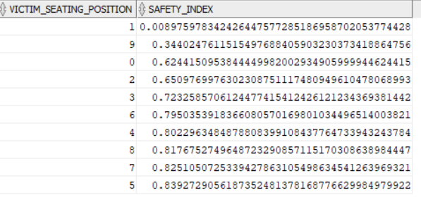

# Deliverable 3

Have to be careful about how many indices we create. Maintaining so many indices is expensive for the database.


DISCLAIMER: Running times are not representative of the actual performance of the queries, for different reasons: 
- Depends on your computer and the connection speed
- Whether on your vpn or not
- Sometimes when you run a query, the db caches the results. So the subsequent records significantly less running times, which may be misleading. 
- The load on the database.

Knowing that, we should put more emphasis on the actual plans chosen by the query optimzer, as well as costs and cardinality.

## Query 4 example
Compute the safety index of each seating position as the fraction of total incidents where the victim
suffered no injury. The position with the highest safety index is the safest, while the one with the lowest
is the most unsafe. List the most safe and unsafe victim seating position along with its safety index

```SQL
SELECT table1.victim_seating_position, table2.non_injured_count / table1.seating_position_count as SAFETY_INDEX
FROM (SELECT V.VICTIM_SEATING_POSITION, COUNT(*) AS SEATING_POSITION_COUNT
      FROM VICTIMS V
      GROUP BY V.VICTIM_SEATING_POSITION) TABLE1, 
      (SELECT V.VICTIM_SEATING_POSITION, COUNT(*) AS NON_INJURED_COUNT
       FROM VICTIMS V
       WHERE V.VICTIM_DEGREE_OF_INJURY = 'no injury'
       GROUP BY V.VICTIM_SEATING_POSITION) TABLE2
WHERE TABLE1.VICTIM_SEATING_POSITION = TABLE2.VICTIM_SEATING_POSITION
ORDER BY SAFETY_INDEX;
```

To compute the safety index for each seating position, we compute the number of victims that were not injured over the total number of victims in that seating position. For this we do 2 nested queries, one that counts the number of victims per seating position, and another one that counts the number of victims that were not injured in that seating position. These intermediary tables (or views) we join by seating position and we just compute the fraction of non injured over the total.

### Results

We can see that the highest safety index is associated to passenger seated at position 5, while the second highest 7 corresponds to safety wagon rear and the third highest 8 corresponds to Rear Occupant of Truck or Van. 

The lowest safety index corresponds to 1 which is the Driver, means the driver ends up almost always injured.

### Optimization
This query was tricky to optimize, because we rely on the intermediary tables created as a result of the nested queries (views as we see in the query plan), and we have no indices for those. All we can optimize however is the two nested queries using indices. First here is the query plan without using any indices 

- Without index

running time: ???

A full table scan is done twice on victims, one for each nested query. And a hash is done to do the group by for each. Finally, a hash join on `victim_seating_position` is done between the two intermediary tables, and then sorted on the fraction. Now an interesting attribute we can create an index on is the `victim_seating_position`

- With index on `victim_seating_position`:

running time: ???

There was significant cost gain for the nested queries. A range scan instead of a full scan is done on the `victim_seating_position` index to compute the first table. Also the join algorithm changes from a hash join to a nested loop, with the outer relation being the one where we filter by the `degree_of_injury` (table2), which makes sense since in that case since that table will have less tuples.

Another interesting thing, is that we created an index on `degree_of_injury` as well, but the query optimizer chose not to use it, the query plan remained as if we only had an index on `victim_seating_position`. However if we introduce a composite index `<seating_positon, degree_of_injury>`, we can avoid doing a full table scan for table2 as we see in the following.

- With index on `victim_seating_position` and composite index `<victim_seating_position, victim_degree_of_injury>`:

running time: ???

Here all the info is contained in the composite index `<victim_seating_position, degree_of_injury>, and we only need to scan for the qualifying data entries inside the index (FAST FULL SCAN).

## Query 7 example
Find all collisions that satisfy the following: the collision was of type pedestrian and all victims were above
100 years old. For each of the qualifying collisions, show the collision id and the age of the eldest collision
victim.

```SQL
SELECT V.CASE_ID, MAX(V.VICTIM_AGE)
FROM VICTIMS V, COLLISIONS C
WHERE V.CASE_ID = C.CASE_ID AND C.TYPE_OF_COLLISION = 'pedestrian'
AND V.VICTIM_AGE IS NOT NULL
GROUP BY V.CASE_ID
HAVING MIN(V.VICTIM_AGE) > 100 AND MAX(V.VICTIM_AGE) <= 125;
```

Here we join victims and collisions of type `pedestrian` on `case_id`. Then we group by the victim `case_id` to get all the victims per collision, and check that **all** the victims are above 100 years old. We also add the additional check that they are below 125 years old, to get rid of values like 998 ("Not stated") or 999 ("Pregnancy") that are not relevant here.

### Results


We had 22 such collisions whose victims are all above 100 years old. The second column corresponds to the eldest victim age of each collision.

### Optimization
Here the query optimizer generates this plan as the best plan for the above query:

Without index

running time: 6.72s

The query plan does a hash join --as expected-- between Victims and Collisions on the `case_id` equality condition. It's also smart enough to push down the selection conditions like checking the `type_of_collision` = 'pedestrian' and that `victim_age` is not null, so that it filters out as much as possible before joining, and thus reducing the number of tuples to join. 

It does a full table scan of both tables to check for both conditions. We can help it by having an index on the `type_of_collision`. So that we have the following:

With index on `type_of_collision`

running time: 7.838s

We can see it does a range scan on the `type_of_collision` index, and retrieves the qualifying data records using that index. This reduces the cost (not by much but still). 

We could also help it by creating an index on the `victim_age`:

With index on `type_of_collision` and `victim_age`

running time: 7.838s

However as we can see the index was not used. It did not improve the query running time nor cost. This is probably because of the selection condition `V.VICTIM_AGE IS NOT NULL`. The `victim_age` index wouldn't help here because there is no equality or inequality, it's a null check and the index cannot help with that (the index search key is not null be default, there is no search key that points to all victims will null `victim_age`). We essentially have to check every victim tuple and check that its `victim_age` is not null. If the selection condition were for example `V.VICTIM_AGE > 100` then the index on `victim_age` would be used, but since this is not the case here since we need to check that for each collision if **all** the victims are above 100 years old, and for that we need to retrieve **all** the victims (hence the full table scan).

The group by is done using a hash algorithm and then the selection is done on aggregates ```MIN(V.VICTIM_AGE) > 100 AND MAX(V.VICTIM_AGE) <= 125```. However note that the query only asks for the `case_id` which we can retrieve from the victims, as well as the `victim_age` of the eldest victim. We can take advantage of that by introducing a composite index `<case_id, victim_age>`.
That is all the information we need is in that index. 

With index on `type_of_collision` and `<case_id, victim_age>`

running time: 7.838s

We can see a significant reduction of the plan cost, from the initial 27224 to 17756. We can see that we are no longer doing a full table scan on the VICTIMS table, but only on its index (FAST FULL SCAN).

## Query 10
Are there more accidents around dawn, dusk, during the day, or during the night? In case lighting
information is not available, assume the following: the dawn is between 06:00 and 07:59, and dusk
between 18:00 and 19:59 in the period September 1 - March 31; and dawn between 04:00 and 06:00,
and dusk between 20:00 and 21:59 in the period April 1 - August 31. The remaining corresponding times
are night and day. Display the number of accidents, and to which group it belongs, and make your
conclusion based on absolute number of accidents in the given 4 periods

```SQL
SELECT 'DAWN', dawns.count_dawns, 'DAY', days.count_days,
        'DUSK', dusks.count_dusks, 'NIGHT', nights.count_nights
FROM (
    -- DAWN INSTANCES
    SELECT 'DAWN', COUNT(*) as count_dawns
        FROM COLLISIONS C
        WHERE (TO_CHAR(C.COLLISION_DATE, 'MM-DD') BETWEEN '04-01' AND '08-31'
        AND C.COLLISION_TIME BETWEEN '04:00:00' AND '05:59:59') OR
        (TO_CHAR(ADD_MONTHS(C.COLLISION_DATE, 6), 'MM-DD') BETWEEN '03-01' AND '09-31'
        AND C.COLLISION_TIME BETWEEN '06:00:00' AND '07:59:59')) dawns,
    -- DAY INSTANCES
    (SELECT 'DAY', COUNT(*) as count_days
        FROM COLLISIONS C
        WHERE (TO_CHAR(C.COLLISION_DATE, 'MM-DD') BETWEEN '04-01' AND '08-31'
        AND C.COLLISION_TIME BETWEEN '06:00:00' AND '19:59:59') OR
        (TO_CHAR(ADD_MONTHS(C.COLLISION_DATE, 6), 'MM-DD') BETWEEN '03-01' AND '09-31'
        AND C.COLLISION_TIME BETWEEN '08:00:00' AND '17:59:59') OR
        C.ROAD_STATE_ID in (SELECT R.ROAD_STATE_ID FROM ROAD_STATES R WHERE R.LIGHTING = 'daylight')) days,
    -- DUSK INSTANCES
    (SELECT 'DUSK', COUNT(*) as count_dusks
        FROM COLLISIONS C 
        WHERE (TO_CHAR(C.COLLISION_DATE, 'MM-DD') BETWEEN '04-01' AND '08-31'
        AND C.COLLISION_TIME BETWEEN '20:00:00' AND '21:59:59') OR
        (TO_CHAR(ADD_MONTHS(C.COLLISION_DATE, 6), 'MM-DD') BETWEEN '03-01' AND '09-31'
        AND C.COLLISION_TIME BETWEEN '18:00:00' AND '19:59:59')) dusks,
    -- -- NIGHT INSTANCES
    (SELECT 'NIGHT', COUNT(*) as count_nights
        FROM COLLISIONS C
        WHERE (TO_CHAR(C.COLLISION_DATE, 'MM-DD') BETWEEN '04-01' AND '08-31'
        AND ((C.COLLISION_TIME BETWEEN '22:00:00' AND '23:59:59') OR (C.COLLISION_TIME BETWEEN '00:00:00' AND '03:59:59'))) OR
        (TO_CHAR(ADD_MONTHS(C.COLLISION_DATE, 6), 'MM-DD') BETWEEN '03-01' AND '09-31'
        AND ((C.COLLISION_TIME BETWEEN '20:00:00' AND '23:59:59') OR (C.COLLISION_TIME BETWEEN '00:00:00' AND '05:59:59'))) OR 
        (C.ROAD_STATE_ID IN (SELECT R.ROAD_STATE_ID FROM ROAD_STATES R WHERE R.LIGHTING LIKE 'dark%'))) nights;
```

The query is a bit tedious but the reasoning behind is straightforward. We filter based on the time: dawn, day, dusk and dawn and create an intermediary table (view) for each with the total count for each. 

For date comparisons, we were only interested in day and month, however collision date has a year as well. For that we either had to transform it to extract only day and month and do the comparison, or reformat it here using to_char as we did here. In any case the index we create on collision_date is lost unfortunately. Also, using `between` to do range search, we had to be careful of ranges like from "1st Septmber to 31st March", because there is an overflow, so we just added 6 months to the dates so the comparison is between 1st of April to 31st of September, which still preserves the ordering.

For the dusk and dawn collision instances, we couldn't rely on `lighting condition` to separate between the collisions happening at dusk and those happening at dawn since it only states 'dusk or dawn' in `lighting_condition`,  we had to rely only on `collsion_time` for this one. However for collisions happening during day and night, we relied both on the `collision_time` and the `lighting_condition` stored in the associated `Road state` to that collision.

### Results


We can see that the highest count of collisions occur during the day (which includes morning trip to work and rush hour and all in between). This is 2.5 higher than at night (which is still high since people are probably drunk driving with low lighting conditions), and 10 times higher than at dawn or dusk (since there isn't much traffic or pedestrians anyway).