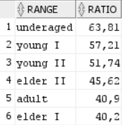
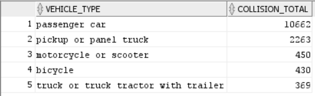
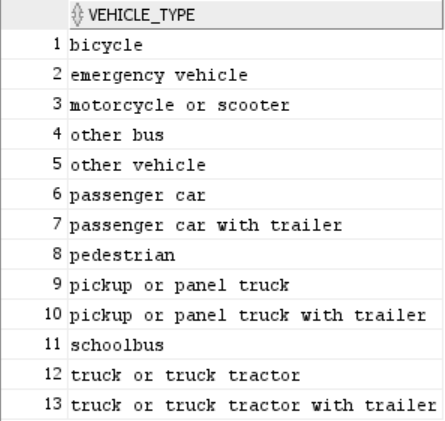
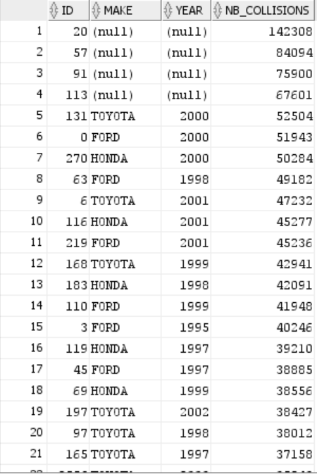

# Queries 

## Last modification on the table using SQL

Once the data is loaded on the DBMS it's complicated to do it all over again because it's pretty time consuming. Unfortunatly we realized that for some column we decided to keep the code letter (*ex : for safety equipment, 'T' instead of 'Child Restraint in Vehicle, Improper Use'*) and we realized afterward that this was a poor choice, since writing the queries after riqueres the whole documentation of the database. But fortunatly, SQL offers some ways to modify the table once they are loaded using the ```ALTER TABLE```command. We thus implemented the following code to fix this issue (*example for associated factor*):

First we create new dummy columns (empty at first) :
```SQL
ALTER TABLE ASSOCIATED_FACTORS 
ADD associated_factor_1 VARCHAR(30);

ALTER TABLE ASSOCIATED_FACTORS
ADD associated_factor_2 VARCHAR(30);

```

Then we fill those column with the required mapping :

```SQL
-- FILL THE CREATED COLUMN WITH THE MAPPING
SELECT CASE WHEN AF.other_associated_factor_1 = 'A' THEN 'Violation'
            WHEN AF.other_associated_factor_1 = 'E' THEN 'Vision Obscurements'
            WHEN AF.other_associated_factor_1 = 'F' THEN 'Inattention'
            WHEN AF.other_associated_factor_1 = 'G' THEN 'Stop and Go Traffic'
            WHEN AF.other_associated_factor_1 = 'H' THEN 'Entering/Leaving Ramp'
            WHEN AF.other_associated_factor_1 = 'I' THEN 'Previous Collision'
            WHEN AF.other_associated_factor_1 = 'J' THEN 'Unfamiliar With Road'
            WHEN AF.other_associated_factor_1 = 'K' THEN 'Defective Vehicle Equipment'
            WHEN AF.other_associated_factor_1 = 'M' THEN 'Uninvolved Vehicle'
            WHEN AF.other_associated_factor_1 = 'N' THEN 'Other'
            WHEN AF.other_associated_factor_1 = 'O' THEN 'None Apparent'
            WHEN AF.other_associated_factor_1 = 'P' THEN 'Inattention, Cell Phone'
            WHEN AF.other_associated_factor_1 = 'Q' THEN 'Inattention, Electronic Equip.'
            WHEN AF.other_associated_factor_1 = 'R' THEN 'Inattention, Radio/CD'
            WHEN AF.other_associated_factor_1 = 'S' THEN 'Inattention, Smoking' 
            WHEN AF.other_associated_factor_1 = 'T' THEN 'Inattention, Eating'
            WHEN AF.other_associated_factor_1 = 'U' THEN 'Inattention, Children'
            WHEN AF.other_associated_factor_1 = 'V' THEN 'Inattention, Animal'
            WHEN AF.other_associated_factor_1 = 'W' THEN 'Inattention, Personal Hygiene'
            WHEN AF.other_associated_factor_1 = 'X' THEN 'Inattention, Reading'
            ELSE 'Inattention, Other' 
        INTO associated_factor_1
        FROM ASSOCIATED_FACTORS AF


SELECT CASE WHEN AF.other_associated_factor_2 = 'A' THEN 'Violation'
            WHEN AF.other_associated_factor_2 = 'E' THEN 'Vision Obscurements'
            WHEN AF.other_associated_factor_2 = 'F' THEN 'Inattention'
            WHEN AF.other_associated_factor_2 = 'G' THEN 'Stop and Go Traffic'
            WHEN AF.other_associated_factor_2 = 'H' THEN 'Entering/Leaving Ramp'
            WHEN AF.other_associated_factor_2 = 'I' THEN 'Previous Collision'
            WHEN AF.other_associated_factor_2 = 'J' THEN 'Unfamiliar With Road'
            WHEN AF.other_associated_factor_2 = 'K' THEN 'Defective Vehicle Equipment'
            WHEN AF.other_associated_factor_2 = 'M' THEN 'Uninvolved Vehicle'
            WHEN AF.other_associated_factor_2 = 'N' THEN 'Other'
            WHEN AF.other_associated_factor_2 = 'O' THEN 'None Apparent'
            WHEN AF.other_associated_factor_2 = 'P' THEN 'Inattention, Cell Phone'
            WHEN AF.other_associated_factor_2 = 'Q' THEN 'Inattention, Electronic Equip.'
            WHEN AF.other_associated_factor_2 = 'R' THEN 'Inattention, Radio/CD'
            WHEN AF.other_associated_factor_2 = 'S' THEN 'Inattention, Smoking' 
            WHEN AF.other_associated_factor_2 = 'T' THEN 'Inattention, Eating'
            WHEN AF.other_associated_factor_2 = 'U' THEN 'Inattention, Children'
            WHEN AF.other_associated_factor_2 = 'V' THEN 'Inattention, Animal'
            WHEN AF.other_associated_factor_2 = 'W' THEN 'Inattention, Personal Hygiene'
            WHEN AF.other_associated_factor_2 = 'X' THEN 'Inattention, Reading'
            ELSE 'Inattention, Other' 
        INTO associated_factor_2
        FROM ASSOCIATED_FACTORS AF
```

Then we drop the initial columns :
```SQL
ALTER TABLE ASSOCIATED_FACTORS DROP COLUMN other_associated_factor_1;
ALTER TABLE ASSOCIATED_FACTORS DROP COLUMN other_associated_factor_2;
```

Then finally we rename the temporary columns as the original ones :
```SQL
ALTER TABLE ASSOCIATED_FACTORS RENAME COLUMN associated_factor_1 TO other_associated_factor_1;
ALTER TABLE ASSOCIATED_FACTORS RENAME COLUMN associated_factor_2 TO other_associated_factor_2;
```

## Query 1

#### Initial version 
```SQL

with ATFAULT as (SELECT CLASSES.range, COUNT(*) as at_fault_cases
FROM (SELECT CASE
    WHEN P.party_age BETWEEN 16 AND 18 THEN 'underaged'
    WHEN P.party_age BETWEEN 19 AND 21 THEN 'young I'
    WHEN P.party_age BETWEEN 22 AND 24 THEN 'young II'
    WHEN P.party_age BETWEEN 25 AND 60 THEN 'adult'
    WHEN P.party_age BETWEEN 61 AND 65 THEN 'elder I'
    ELSE 'elder II' 
    END 
    AS range
    FROM PARTIES P
    WHERE P.at_fault = 1) CLASSES
GROUP BY CLASSES.range),

TOTALS as (SELECT TCLASSES.range, COUNT(*) as total_cases
FROM (SELECT CASE
    WHEN P.party_age BETWEEN 16 AND 18 THEN 'underaged'
    WHEN P.party_age BETWEEN 19 AND 21 THEN 'young I'
    WHEN P.party_age BETWEEN 22 AND 24 THEN 'young II'
    WHEN P.party_age BETWEEN 25 AND 60 THEN 'adult'
    WHEN P.party_age BETWEEN 61 AND 65 THEN 'elder I'
    ELSE 'elder II' 
    END 
    AS range
    FROM PARTIES P) TCLASSES
GROUP BY TCLASSES.range)

SELECT AF.range, ROUND(AF.at_fault_cases * 100 / T.total_cases, 2) as ratio
FROM ATFAULT AF, TOTALS T
WHERE AF.range = T.range
```


#### Final version 

```SQL
with CLASSES as (SELECT P.at_fault,
    CASE WHEN P.party_age BETWEEN 16 AND 18 THEN 'underaged'
         WHEN P.party_age BETWEEN 19 AND 21 THEN 'young I'
         WHEN P.party_age BETWEEN 22 AND 24 THEN 'young II'
         WHEN P.party_age BETWEEN 25 AND 60 THEN 'adult'
         WHEN P.party_age BETWEEN 61 AND 65 THEN 'elder I'
         ELSE 'elder II'
    END AS range
    FROM PARTIES P)

SELECT C.range, ROUND(SUM(C.at_fault)*100 /  COUNT(*), 2) as ratio
FROM CLASSES C
GROUP BY C.range
ORDER BY ratio DESC;
```

#### Result 



An insurance company would thus charge more an underaged or young drivers for an insurance.


#### Explanation and discussion

The first query select the ```at_fault``` and age category attribute of all the parties. Then the final query selects the range and does the compute the percentage of parties at fault for every age class. Since ```at_fault``` is stored as ```1``` or ```0``` the number of parties that are at fault is just the sum of all these values. By rewriting the query we do only one projection statement and thus, go through the whole dataset only once. The physical plan becomes much smaller.


## Query 2

#### Implementation 
```SQL
WITH COLLISIONS_HOLES as (
SELECT C.case_id, P.vehicle_id
FROM Collisions C, ROAD_STATES RS, PARTIES P
WHERE  C.road_state_id = RS.road_state_id AND 
(RS.road_condition_1 = 'holes' OR RS.road_condition_2 = 'holes')
AND P.case_id = C.case_id
)

SELECT VT.statewide_vehicle_type, COUNT(*) AS collision_total
FROM VEHICLES VT, COLLISIONS_HOLES CH 
WHERE VT.vehicle_id = CH.vehicle_id AND VT.statewide_vehicle_type IS NOT NULL
GROUP BY statewide_vehicle_type
ORDER BY collision_total DESC
FETCH FIRST 5 ROWS ONLY; 
```

#### Result



#### Explanation and discussion

The first query selects all the unique tuples ```(vehicle_id, case_id)``` that are involved in a collision for which the road state is *holes*. To do so we need multiple join, one between ```Collisions``` and ```Road_states```, and one between ```Collisions``` and the ```Parties```. We also use a selection of the right road states before hand. Finally in the second we use this result and join it with ```Vehicles``` to get the ```statewide_vehicle_type``` and group by this attribute to get the number of entries with a precise type. Finally we order the result by descending value of number of collision and select only the top 5 entries. During the join we also make sure to discard the vehicles for which the vehicle type is ```NULL```.


## Query 5

#### Implementation

```SQL
WITH COLLISION_V AS (
SELECT COUNT(C.case_id) as nb_collisions, L.county_city_location AS city, V.statewide_vehicle_type as vehicle_type
FROM COLLISIONS C, PARTIES P, VEHICLES V, LOCATIONS L
WHERE C.case_id = P.case_id AND V.vehicle_id = P.vehicle_id AND L.location_id = C.location_id
GROUP BY V.statewide_vehicle_type, L.county_city_location
),

STAT as (SELECT CV.vehicle_type, COUNT(CV.city) as nb_cities 
FROM COLLISION_V CV
WHERE CV.nb_collisions > 10
GROUP BY CV.vehicle_type),

TOTAL_CITIES AS (
SELECT COUNT(DISTINCT L.county_city_location) as total_cities
FROM LOCATIONS L)

SELECT S.vehicle_type
FROM STAT S, TOTAL_CITIES TOTAL
WHERE S.nb_cities >= TOTAL.total_cities / 2 AND vehicle_type IS NOT NULL
```


#### Result 




#### Explanation and discussion 

In the first query we get all the tuples ```(county_city_location, statewide_vehicle_type, nb_collisions)```, ie, for every vehicle type all the collision that occured in evry city. This is made by joining ```Collisions``` with ```Parties```, and ```Parties``` with ```Vehicles``` to get the vehicle type, and ```Collisions``` with ```Locations``` to get the corresponding city. The number of collisions is found by grouping by ```(county_city_location, statewide_vehicle_type``` and counting the number of entries.

The second query compute the counts of cities in which a given vehicle type had more than 10 collisions. Thus we only have to do a selection over the previous query on the predicate ```nb_collisions > 10```, grouping by the vehicle type and counting the number of entries. 

For the final computation we also need to compute the total number of cities in the dataset and this is done by counting the number of distinct number of ```county_city_location``` in the ```Locations``` table.

Finally, the last query is a simple selection of the entry of the second one. Only the entries for which the number of city is greater than (or equal) the half of the total number of cities are chosen.


## Query 8

#### Implementation

```SQL
WITH TEMP AS (SELECT V.vehicle_id as id, V.vehicle_make as make, V.vehicle_year as year, COUNT(C.case_id) as nb_collisions
FROM COLLISIONS C, VEHICLES V, PARTIES P 
WHERE C.case_id = P.case_id AND V.vehicle_id = P.vehicle_id
GROUP BY V.vehicle_make, V.vehicle_year, V.vehicle_id
)

SELECT T.id, T.make, T.year, T.nb_collisions
FROM TEMP T
WHERE T.nb_collisions > 10
ORDER BY T.nb_collisions DESC
```


#### Result



This is only a short version of the result since there are many more rows.

We can see, in a first place, that a huge number of time the car make and the year of the vehicle is not reported. More over we can see that we can see a lot of time the car make is **TOYOTA**, **FORD**, and **HONDA**. This is not very surprising because if we look at the biggest car salers in the United States in 2020 the top 4 car salers were (in that order): Ford, Toyota, Chevrolet, and Honda. This is not a new trend since in 2010 the ranking was: Ford, Chevrolet, Toyota, and Honda. The next car make that appears in the result in Chevrolet. This is thus normal that the most common car have the most accident.

sources :
- https://www.statista.com/statistics/264362/leading-car-brands-in-the-us-based-on-vehicle-sales/
- https://www.goodcarbadcar.net/us-auto-sales-by-brand-2010-year-end/

#### Explanation and discussion 

The first query selects all the tuples ```(vehicle_id, vehicle_make, vehicle_year, nb_collisions)```. Where ```nb_collisions``` is simply the number of Collisions in which the precise tuple ```(vehicle_id, vehicle_make, vehicle_year)``` was involved. This is done by joining ```Collisions``` with ```Parties```, and ```Parties``` with ```Vehicles``` and grouping by the 3 attributes cited before to get the number of collisions.

Then, the second query is simply a selection of the entries of the first checking that the number of collisions is above 10. We then sort the output in desceding order of number of collision.


