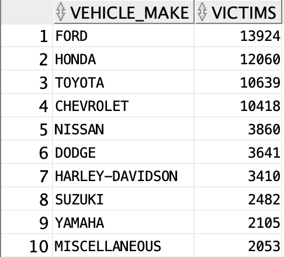

# Queries 

## Query 3

#### Implementation

```SQL
SELECT  c.vehicle_make, COUNT(*) AS victims 
FROM parties P , victims V, vehicles C
WHERE P.case_id = V.case_id AND P.party_number = V.party_number 
        AND   C.vehicle_id = P.vehicle_id 
        AND C.vehicle_make <> 'NOT STATED'
        AND c.vehicle_make is not null
        AND (V.victim_degree_of_injury = 'severe injury'  OR V.victim_degree_of_injury = 'killed' )
GROUP BY  c.vehicle_make
ORDER BY victims DESC
FETCH FIRST 10 ROWS ONLY;
```


#### Result 




#### Explanation and discussion 
In this query, we need to join ```parties``` and ```victims``` on both ```case_id``` and ```party_number``` in order to group the victims of the same party together for each collision case (victims that are in the same vehicle), and through  the ```where``` clause, we only consider the victims who suffered either a _severe injury_ or were _killed_ .
We also join ```vehicles``` with ```parties``` on ```vehicle_id``` to get the corresponding vehicle for each party.
Now we can group this result on attribute  ```vehicle_make``` and count the rows for each distinct ```vehicle_make``` value to get the number of victims per vehicle make.


## Query 6

#### Implementation

```SQL
WITH cities AS 
(SELECT DISTINCT L.county_city_location AS city_location , l.location_population AS population
FROM collisions C , locations L 
WHERE C.location_id = L.location_id  AND L.location_population BETWEEN 1 AND 7
ORDER BY L.location_population DESC
FETCH FIRST 3 ROWS ONLY),

B AS (
SELECT  T.city_location AS city_location , C.case_id AS case_id , AVG(victim_age) AS average_victim_age 
FROM victims V, collisions C , locations L , cities T
WHERE V.case_id = C.case_id AND C.location_id = L.location_id AND  L.county_city_location = T.city_location AND V.victim_age is not null
group by T.city_location , C.case_id
ORDER BY T.city_location, average_victim_age
),

rws AS (
SELECT B.city_location, B.case_id , B.average_victim_age, 
        rank() over (
        partition by B.city_location
        order by  B.average_victim_age, B.case_id) rn
FROM  B
),

rws_selected AS (
SELECT * 
FROM rws
WHERE  rn <= 10) 

SELECT C.city_location, C.population , R.case_id , R.average_victim_age
FROM rws_selected R , cities C
WHERE R.city_location = C.city_location;
```


#### Result 


#### Explanation and discussion 
For this query, using the first ```with``` clause, we retrieve the 3 cities in which we are interested in (the top-3 most populated cities). Note that in the case where more than 3 cities satisfy this condition (have the same maximal value for location_population), we arbitrarily select 3 of them.
Now that we have the 3 cities, we create a temporary table ```B``` that holds for each city, and for each collision that occurred in that particular city, the average age of the victims. Also note that we only consider the collisions for which the age of the victims is available i.e. ```not null```.
In the third temporary table ```rws```, we use ```partition by``` on ```city_location``` and an ascending ordering on ```average_victim_age```. 
Finally, using ```rank()```, we return the 10 first rows (bottom-10 collisions)  per partition and the corresponding ```average_victim_age```. 


## Query 9

#### Implementation

```SQL
SELECT L.county_city_location  AS city_location , count(C.case_id) AS number_of_collisions
FROM collisions C, Locations L 
WHERE C.location_id = L.location_id
GROUP BY L.county_city_location 
ORDER BY number_of_collisions DESC
FETCH FIRST 10 ROWS ONLY;
```

#### Result 


#### Explanation and discussion 
In this query, we want the top-10 cities with the highest number of collisions. 
Therefore we join ```collisions ``` and ```locations``` on ```location_id``` in order to get the location for each collision.
We group this by the ```county_city_location``` and count the number of collisions that occured at that particular city. 
We order the result on ```number_of_collisions``` and fetch the 10 first rows.

