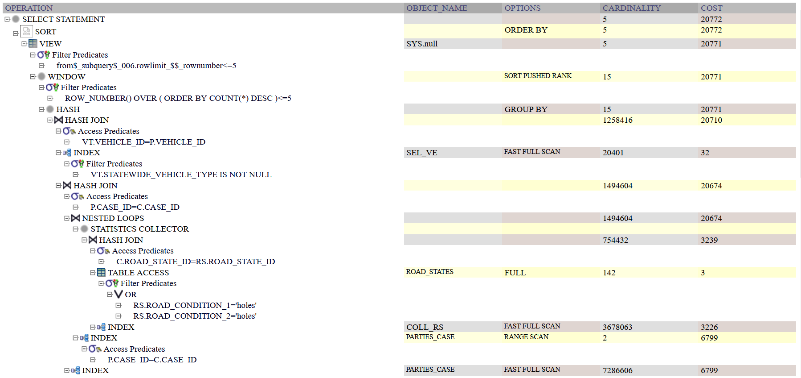
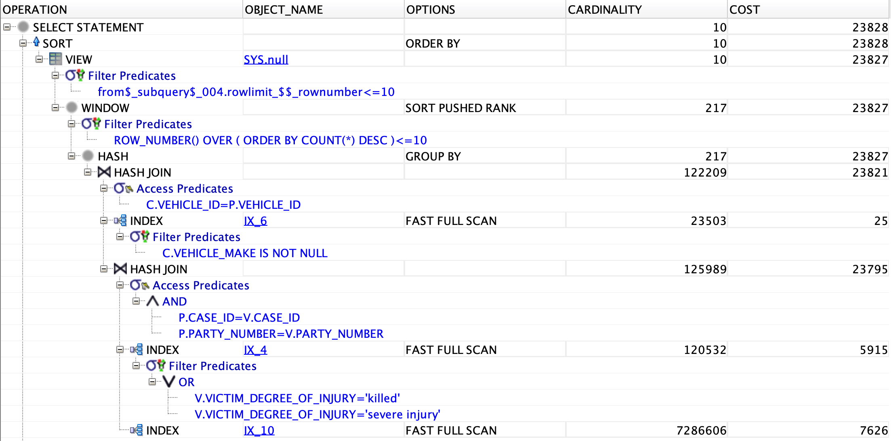
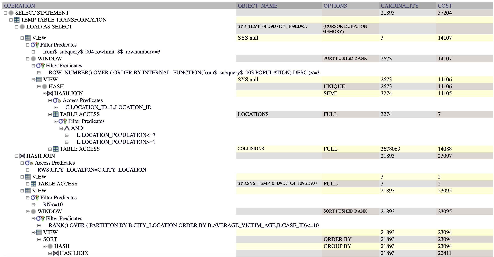
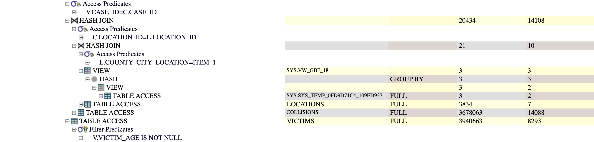
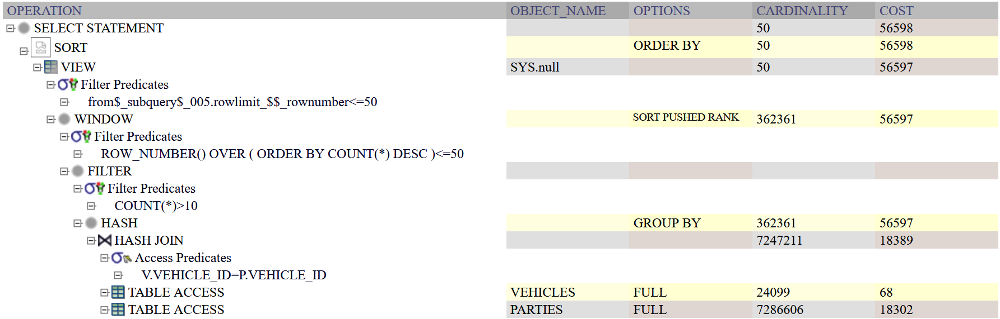
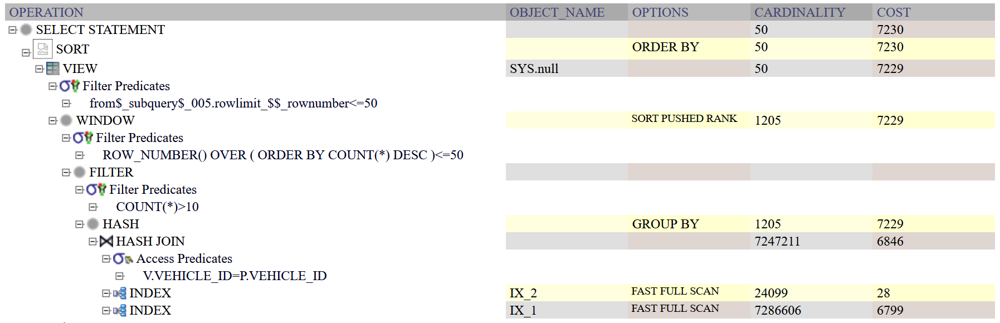
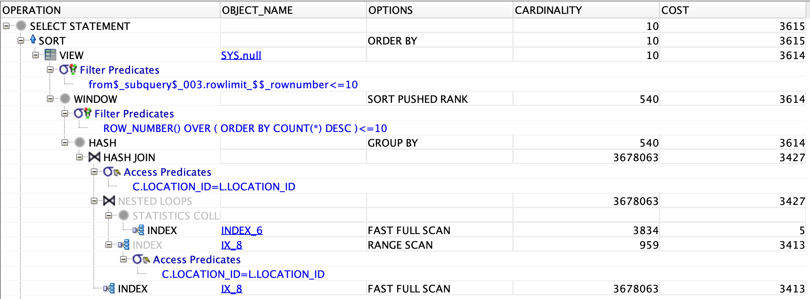

# Optimization :

## SUMMARY 

##### query 1 :

<ins>init :</ins>
- runtime : 3.577 secondes
- cost : 56214

<ins>final :</ins>
- runtime : 3.018 secondes
- cost : 21836
- gain : 1.744 secondes, 34378 of cost
- speedup factor : 1.95


##### query 2 :

<ins>init :</ins> 
- runtime : 1.416 secondes
- cost : 366896

<ins>final :</ins> 
- runtime : 0.508 secondes
- cost : 207073
- gain : 0.908 secondes, 159823 cost
- speedup factor : 2.79

##### query 3 :

<ins>init :</ins> 
- runtime :  5.157 secondes
- cost : 340300

<ins>final :</ins> 
- runtime : 1.5 secondes
- cost : 180319
- gain : 3.6 secondes,  cost 159981
- speedup factor : 3.43

##### query 5 :

<ins>init :</ins>
- runtime : 8.3 secondes
- cost : 465892

<ins> final :</ins>
- runtime : 7.115 secondes
- cost :  256333
- gain : 1.185 secondes, 209559 operations
- speedup factor : 1.17


##### query 6 :

<ins>init :</ins> 
- runtime : 28.503 secondes
- cost : 319331

<ins>final :</ins> 
- runtime : 7.477 secondes
- cost : 104558
- gain : 21.026 secondes,  cost 214773
- speedup factor : 3.8

##### query 8 :

<ins>init :</ins>
- runtime : 5.87 secondes
- cost : 319755


<ins> final :</ins>
- runtime : 3.229 secondes
- cost : 49820
- gain : 2.641 secondes, 269935 cost
- speedup : 1.82


##### query 9 :

<ins>init :</ins> 
- runtime : 3.403secondes
- cost : 85358

<ins>final :</ins> 
- runtime : 2.09 secondes
- cost : 31757
- gain : 1.313 secondes, cost 53601
- speedup factor : 1.628


## Query 1 :

<ins>initial benchmark :</ins>
- runtime : 3.577 secondes
- cost : 19469 + 18469 + 18276 = 56214


<ins>final benchmark :</ins>
- runtime : 3.018 secondes
- cost : <span style="color:red">7343</span> + <span style="color:red">7343</span> + <span style="color:red">7150</span> = 21836
- gain : <span style="color:red">1.744</span> secondes, <span style="color:red">34378</span> of cost
- speedup factor : <span style="color:red">1.95</span>


using :
```SQL
CREATE INDEX ages_ix ON PARTIES(case_id, party_age, at_fault);
```


<ins>explanation:</ins> We make this access more efficient by using an index on ```case_id```, ```party_age```, ```at_fault``` at once. Hash projection are much more efficient when you have an index on all the projected attributes. 

## Query 2 :

<ins>initial benchmark :</ins> 
- runtime : 1.416 secondes
- cost : 43190 + 43190 + 43189 + 43189 + 43128 + 68 + 43056 + 43056 + 14118 + 3 + 14105 + 18302 + 18302 = 366896


<ins>final benchmark :</ins> 
- runtime : 0.508 secondes
- cost : <span style="color:red">20808</span> + <span style="color:red">20808</span> + <span style="color:red">20808</span> + <span style="color:red">20807</span> + <span style="color:red">20807</span> + <span style="color:red">20807</span> + <span style="color:red">20746</span> + 68 + <span style="color:red">20674</span> + <span style="color:red">20674</span> + <span style="color:red">3239</span> + 3 + <span style="color:red">3226</span> + <span style="color:red">6799</span> + <span style="color:red">6799</span> = 207073
- gain : <span style="color:red">0.908 secondes, 159823 cost</span>
- speedup factor : <span style="color:red">2.79</span>


using : 
```SQL
CREATE INDEX coll_rs ON Collisions(case_id, road_state_id);
CREATE INDEX parties_case ON Parties(case_id, vehicle_id);
```


<ins>explanation :</ins> We can see that thanks to the index on parties the access to the table ```parties``` is 3 times faster and the access and the access to ```collisions``` is more than 4 times quicker. In the initial query, the bottlenecks were all the joins and using those two indexes they are sped up by a factor 2.

We also add these two indexes : 

```SQL
CREATE INDEX rs ON ROAD_STATES(road_condition_1, road_condition_2);
CREATE INDEX sel_ve on VEHICLES(vehicle_id, statewide_vehicle_type);
```



## Query 3 :

<ins>initial benchmark :</ins>
- runtime : 5.157 secondes
- cost : 36936+36936 +36935 +36935 +36935 +36928 +68 +36860+36860 +8303 +18302 +18302 = 340300


<ins>final benchmark :</ins>
- runtime :  1.5 secondes
- cost : 23828+23828+23827+23827+23827+23821+25+23795+5915+7626 = 180319
- gain : 3.6 secondes, cost 159981
- speedup factor : 3.43



using :
```SQL
CREATE INDEX ix_4 ON victims(case_id,party_number ,victim_degree_of_injury );
CREATE INDEX ix_10 ON parties( vehicle_id,case_id,party_number);
```

<ins>explanation :</ins> The most costly part in this query is the join of the relations ```parties``` and ```vehicles``` on ```vehicle_id```. For this reason, we create the index ```ix_10``` for ```parties``` on ```vehicle_id``` followed by ```case_id``` and ```party_number```. Moreover, we can create an additional index ```ix_4``` for victims on ```case_id```, ```party_number``` followed by ```victim_degree_of_injury``` as we also join on this attribute. 

## Query 5 :

<ins>initial benchmark :</ins>
- runtime : 8.3 secondes
- cost : 46196 + 46196 + 8 + 8 + 8 + 7 + 46188 + 46188 + 46188 + 46188 + 46027 + 7 + 46005 + 68 + 45918 + 14088 + 18302 + 18302 = 465892


<ins> final benchmark :</ins>
- runtime : 7.115 secondes
- cost : <span style="color:red">24015</span> + <span style="color:red">24015</span> + 6 + 6 + 6 + 5 + <span style="color:red">24009</span> + <span style="color:red">24009</span> + <span style="color:red">24009</span> + <span style="color:red">24009</span> + <span style="color:red">23848</span> + 5 + <span style="color:red">23828</span> + 68 + <span style="color:red">23741</span> + <span style="color:red">23741</span> + <span style="color:red">3415</span> + <span style="color:red">6799</span> + <span style="color:red">6799</span> = 256333
- gain : <span style="color:red">1.185</span> secondes, <span style="color:red">209559</span> operations
- speedup factor : <span style="color:red">1.17</span>


using :
```SQL
CREATE INDEX coll_rs ON Collisions(case_id, location_id);
CREATE INDEX parties_case ON Parties(case_id, vehicle_id);
CREATE INDEX cv_nb ON LOCATIONS(location_id, county_city_location);
```

<ins>explanation :</ins> We can see that using the indexes ```coll_rs``` and ```parties_case```, the cost of accessing the tables ```Collisions``` and ```Parties``` is divided by 3. More over, even though the cardinalities remains the same and the logical plan remains maily the same, the cost of all the joins and the predicates are all divided by 2.

## Query 6 :

<ins>initial benchmark :</ins>
- runtime : 28.503 secondes
- cost : 37205+14107+14107+14106+14106+14105+7+14088+23097+2+2+23095+23095+23094+23094+23094+22411+14108+10+3+3+2+2+7+14088+8293 = 319331





<ins>final benchmark :</ins>
- runtime : 7.477 secondes
- cost : 12534+3431+3431+3430+3430+3429 +7+3413+9102+2+2+9100+9100+9099+9099+9099+8416+113+8+3+3+2+2+5+5+8293 = 104558
- gain : 21.026 secondes, cost 214773
- speedup factor : 3.8


using :
```SQL
CREATE INDEX ix_8 ON collisions(location_id , case_id );
```
<ins>explanation :</ins> The cost of the initial query is approximately divided by 3 thanks to index ```ix_8```. In fact, by creating an index for ```collisions``` on ```location_id``` followed by ```case_id```, we make the join operation with ```locations``` (that has attribute ```location_id``` as primary key) way faster.

## Query 8 :

<ins>initial benchmark :</ins>
- runtime : 5.87 secondes
- cost : 56598 + 56598 + 56597 + 56597 + 56597 + 18398 + 68 + 18302 = 319755



<ins> final benchmark :</ins>
- runtime : 3.229 secondes
- cost : <span style="color:red">7230</span> + <span style="color:red">7230</span> + <span style="color:red">7229</span> + <span style="color:red">7229</span> + <span style="color:red">7229</span> + <span style="color:red">6846</span> + 28 + <span style="color:red">6799</span> = 49820
- gain : <span style="color:red">2.641</span> secondes, <span style="color:red">269935</span> cost
- speedup : <span style="color:red">1.82</span>



using :

```SQL
CREATE INDEX ix_1 ON PARTIES(case_id, vehicle_id);
CREATE INDEX ix_2 ON VEHICLES(vehicle_id, vehicle_year, vehicle_make);
```

<ins>explanation :</ins> Thanks to the index ```ix_1```, the cost of accessing the table ```Parties``` is divided by 3. The cost of all the other joins, projection, and selection is divided by nearly 8 using the two indeces. ```ix_2``` allows a huge break through because we do twice a projection over all these attributes.

## Query 9 :

<ins>initial benchmark :</ins>
- runtime : 3.403 secondes
- cost : 14291+ 14291+ 14290+ 14290+ 14103+ 5+ 14088 = 85358


<ins>final benchmark :</ins>
- runtime : 2.09 secondes
- cost : 3615+3615+3614+3614+3614+3427+3427+5+3413+3413= 31757
- gain : 1.313 secondes, cost 53601
- speedup factor : 1.628
 
 
using :
```SQL
CREATE INDEX ix_8 ON collisions(location_id , case_id );
```

<ins>explanation :</ins> For the same reason as in query 6, index ```ix_8``` makes the join between ```collisions``` and ```locations``` on ```location_id``` fast compared to the initial version and we can observe that the overall cost is approximately divided by 3 as well.

