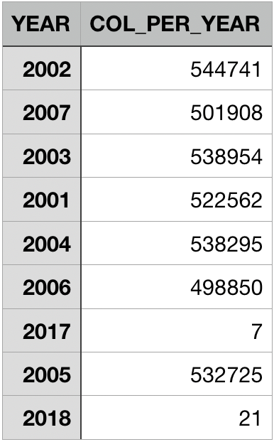
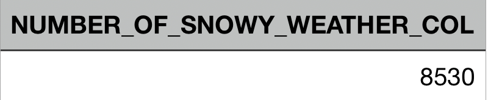
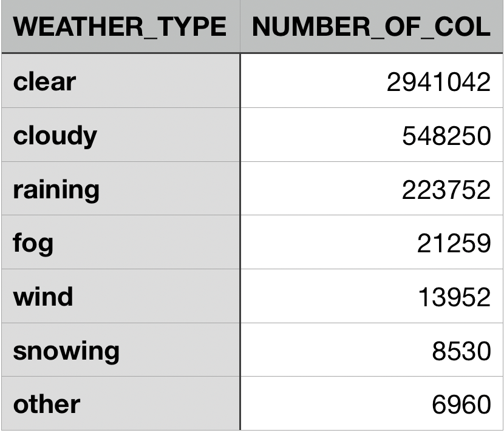
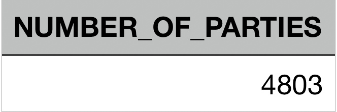
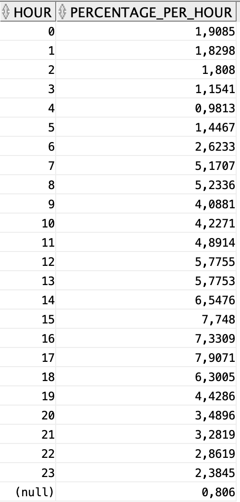
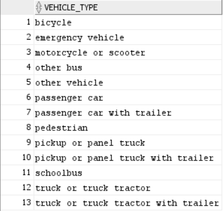
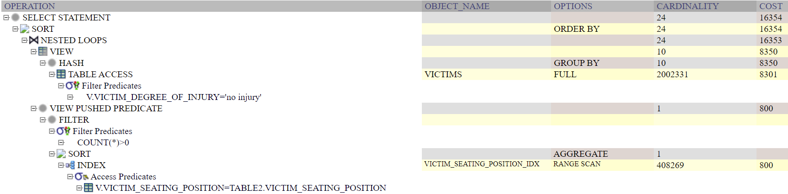

<div align="center">
    <h1>Database project 2021</h1>
    <h6>Stephane Selim (235786), Emna Fendri (297286), Antoine Magron (288416)</h6>
</div>


# Deliverable 1 :


## ER Diagram

#### <ins>ER Diagram :</ins>

[//]: <> (Displays the ER diagram big enough so that every attributes can be seen properly)
<div jutify-content="center" align-items="center">
    
</div>

#### <ins>Description :</ins>

In this ER diagram we design the structure of our future database. They are 8 entities :

- <ins>Collision :</ins> This entity describe the collision that occured. It has attributes like **collision_date**, **collision_time**, the **collision_type** or whether the collision if **school_bus_related** or not.  A **case_id** is provided and can be the Primary Key of this entity since it's unique for all of them.

- <ins>Party :</ins> This entity describes a party involved in a collision. It contains attributes like **at_fault**, the **party_age** or whether the party is financially responsible or not. The Primary key given with the unique qualifier **party_id**. It's related to Collision thanks to a relation called <span style="color:red">involved_in</span>. In this relation the Parties have a mandatory participation. Indeed if a person is party it means that it was involved in an accident. Moreover a collision needs to have parties so the collision also have a mandatory participation. A party can participate in only one collision so the relation is On-to-Many.


- <ins> Vehicle :</ins> This entity describes the vehicle a party was using during the collision. It's describe by the **statewide_vehicle_type**, **vehicle_make**, and the **vehicle_make**. The Primary key is not given and will have to be generated later. It's relation to a party via the relation <span style="color:red">owns</span>. A party can have at most one vehicle and so the relation is One-to-Many.

- <ins> Victims :</ins> This entity the victims of each parties (can be itself if injured). It already has a Primary key **victim_id** and is described by various attributes like **party_number**, its age, sex, role or **degree_of_injury**. It's involved in a relation <span style="color:red">has_a</span> with Party where it has a participation and key constraint.A victims is always involved in a collision because of a single party. A victim is thus a weak entity of Party.

- <ins> Safety Equipment :</ins> This entity is described only by it's primary key ie. the value of the equipement (a letter). It's in a relation <span style="color:red">party_used_equiment</span> with the Party entity and <span style="color:red">victim_used_equiment</span> with the Victim entity. This is made an entity because the field is present in the two entites. We cannot set any participation constraints here because the fields may be "blank" or "null", ie. the value can be missing.


- <ins> Location :</ins> This entity contains all the attributes that describes the location of the collision. It contains attributes like **county_city_location**, **population**, and **jurisdition**. None of these values are unique, but there combination is. We will have to generate a primary key afterward. It's involved in a One-to-Many relation with Collision in the relation <span style="color:red">occured_at</span>. A collision can only have extacly one (participation constraint as well) location but many collision can occur at the same location. 


- <ins> PCF :</ins> There is a lot of attributes concerning the PCF, and all type of PCF violation like **pcf_violations** or **pcf_collision_factor". We thus decided to put them all in an entity, PCF. The primary key of this entity will be generated later. This entity is involved in a relation with <span style="color:red">violated</span>. A Collision can have at most one link to a instance of PCF. It's thus a one to many relationship. Since all of these attributes can be null the participation from Collision is not mandatory so we cannot set a participation cosntraint.


## Assumptions and constraints

-	A party refers to a person that is directly involved in the accident.
-	Participants of the accident that are not parties are automatically considered as victims. 
-	Each victim is associated to exactly one party. (1-to-N)  
-	Only injured parties are considered as victims. 
-	Many collisions can occur at the same location, but a collision occurs in only one location. (1-to-N)
- A party in a collision may or may not possess one vehicle.
- A collisions may have one pcf violation registered (1-to-N). 

### Translation of ER diagram to relational model
- Tables were created for the above mentioned entities, namely:
*Parties*, *Victims*, *Collisions*, *Locations*, *Vehicles*, *safety_equipments*, *pcf_violations* as well as for the relationships *party_safety_equipment* and *victim_safety_equipment*.

- **Choice between factorizing some attributes into separate entities**: In the initial model, tables were created for *weather* and *conditions*. However we factorized both inside collisions because we don't really need tables for them. Here is the argument for that: let's say we have *conditions* table
with attributes *lighting*, *road_condition*, *road_surface*. If we attribute a unique id to 
each condition entity, we can have redundancies if we have the same exact conditions, but
with different ids, and the goal is to eliminate redundancies. <br>
We can make primary key as (*lighting*, *road_condition*, *road_surface*) to identify a single conditions instance, which the collision
table would have as foreign key to refer to that entity. So the 3 conditions attributes would be included
anyway in the Collision table, and would just refer to an entity in which the only supplementary
information would be the condition id.
So it's best to factor the condition inside the collisions table, which would save space by 
eliminating redundancies, and results in less joins when querying over the data later.

- **Vehicles** denote general model vehicles, and not a specific vehicle attributed to someone. So an idea was to make the primary key a composite one: (*vehicle_make*, *vehicle_year*, *statewide_vehicle_type*), but this means that the party table will have these 3 attributes each time they refer to the same vehicle. A bit of the same dilemna with the aforementioned conditions table. But vehicle models denote unique entities and warrant their own entity table. So an idea is to generate a unique id to each vehicle model. This would have to be done during data loading and not let SQL generate a unique ID, since it will generate differents instances of the same model but with different ids.

- *Parties* is a weak entity of *Collisions*, and *Victims* is a weak entity of *Parties*. So if the strong entity is deleted, the weak is deleted as well.

**Note**: 
- 1-to-many relationships don't need an intermediate table.
- attribute tow_away was first an attribute of *vehicles* but we moved it to *collisions*. After observing the dataset, it seems it's more related to *collisions* to indicate generally whether the tow-truck has been called in or not.


## DDL commands
```
-- Party Table --
-- (Weak entity of COLLISIONS) --
CREATE TABLE PARTIES(
    case_id INTEGER NOT NULL,
    party_number INTEGER NOT NULL,
    at_fault BOOLEAN,
    cellphone_use CHAR(1),
    financial_responsability CHAR(1),
    hazardous_materials CHAR(1),
    movement_preceding_collision CHAR(1),
    other_associated_factor CHAR(1),
    other_associated_factor CHAR(1),
    party_age INTEGER,
    party_sex CHAR(1),
    /* The following two are similar */
    party_drug_physical CHAR(1),
    party_sobriety CHAR(1),
    /* party type is stored as its string value
    (will have to map to corresponding integer in the handout when loading the data) */
    party_type INTEGER,
    vehicle_id INTEGER,
    PRIMARY KEY(case_id, party_number),
    FOREIGN KEY(vehicle_id) REFERENCES VEHICLES,
    FOREIGN KEY(case_id) REFERENCES COLLISIONS ON DELETE CASCADE 
);

-- Collisions Table --
CREATE TABLE COLLISIONS(
    case_id INTEGER NOT NULL,
    -- location
    county_city_location INTEGER,
    jurisdiction INTEGER,
    -- Maybe merge date and time into single attribute?
    collision_date DATE,
    collision_time CHAR(8),
    -- Collision_severity is stored in its string value, should map to its corresponding integer --
    collision_severity INTEGER,
    hit_and_run CHAR(1),
    lighting CHAR(1),
    officer_id INTEGER,
    pcf_violation INTEGER,
    process_date DATE,
    ramp_intersection INTEGER,
    -- Road conditions are stored as their string value, should map to their corresponding integers. --
    road_condition_1 INTEGER,
    road_condition_2 INTEGER,
    road_surface CHAR(10),
    -- tow_away stored as 0,1 or nan --
    tow_away BOOLEAN,
    /* type of collision and both weathers are stored as their string value,
    should map to their corresponding integers in the handout */
    type_of_collision CHAR(1),
    weather_1 CHAR(1),
    weather_2 CHAR(1),
    -- school_bus_related Is either 'E' or blank in the dataset
    school_bus_related BOOLEAN NOT NULL,
    PRIMARY KEY(case_id),
    FOREIGN KEY(pcf_violation) REFERENCES PCF_VIOLATION,
    FOREIGN KEY(county_city_location, jurisdiction) REFERENCES LOCATIONS
);

-- Victims Table --
-- (Weak entity of Parties)
CREATE TABLE VICTIMS(
    id INTEGER NOT NULL,
    case_id INTEGER NOT NULL,
    party_number INTEGER NOT NULL,
    victim_age INTEGER,
    /* degree of injury stored as its string value, should map to its integer 
    counterpart as described in the handout */
    victim_degree_of_injury INTEGER,
    victim_ejected INTEGER,
    victim_role INTEGER,
    victim_seating_position INTEGER, 
    -- stored as 'male', 'female' or nan
    victim_sex CHAR(1),
    PRIMARY KEY (id),
    FOREIGN KEY(case_id, party_number) REFERENCES PARTIES ON DELETE CASCADE
);

-- Safety equipments table --
CREATE TABLE SAFETY_EQUIPMENTS(
    safety_equipment CHAR(1) NOT NULL,
    PRIMARY KEY(safety_equipment)
);


-- Relationship between parties and safety equipments --
CREATE TABLE PARTY_USED_EQUIPMENT(
    case_id INTEGER NOT NULL,
    party_number INTEGER NOT NULL,
    safety_equipment CHAR(1) NOT NULL,
    PRIMARY KEY(case_id, party_number, safety_equipment),
    FOREIGN KEY(case_id, party_number) REFERENCES PARTIES,
    FOREIGN KEY(safety_equipment) REFERENCES SAFETY_EQUIPMENTS
)

-- Relationship between victims and safety equipment --
CREATE TABLE VICTIM_USED_EQUIPMENT(
    victim_id INTEGER NOT NULL,
    safety_equipment CHAR(1) NOT NULL,
    PRIMARY KEY(victim_id, safety_equipment),
    FOREIGN KEY(victim_id) REFERENCES VICTIMS(id),
    FOREIGN KEY(safety_equipment) REFERENCES SAFETY_EQUIPMENTS
)


-- Table for pcf (primary_collision_factor) violation --
CREATE TABLE PCF_VIOLATION(
    pcf_violation INTEGER,
    -- pcf is stored in its string value, consider converting to its 1 char code --
    primary_collision_factor CHAR(1),
    pcf_violation_category CHAR(32),
    pcf_violation_subsection CHAR(1),
    PRIMARY KEY (pcf_violation)
)

-- Locations Table --
CREATE TABLE LOCATIONS(
    county_city_location INTEGER,
    jurisdiction INTEGER, 
    location_type CHAR(1),
    population INTEGER,
    PRIMARY KEY(county_city_location, jurisdiction)
);

-- Vehicles Table --
CREATE TABLE VEHICLES(
    vehicle_id INTEGER,
    statewide_vehicle_type CHAR(1),
    vehicle_make CHAR(1),
    vehicle_year CHAR(1)
    PRIMARY KEY(vehicle_id)
);
```

## General comments

For this deliverable, we first started by defining the ER schema. Each one of us created one in order to merge our work afterward and keep the most convenient ideas according to the data that is given. To create the relational schema from the ER schema we needed to discuss together about some details and made sure that we all agree with the final schema.

The database we'll be working with is the Oracle database recommended by the course, and we'll be interacting with it using the frontend SQL Developer IDE.


# Deliverable 2


## Updates to ER diagram and DDL

Since last milestone, we've updated our ER diagram and data structure as well as the ddl for creating tables in the database to take into account the feedback given for the 1st deliverable. Some of these changes were also done as a convenience when cleaning and loading the data efficiently and without collisions. Here are some of the changes:


- `locations` has now a uniquely generated id as primary key. During the data preprocesing, we noticed that the (`county_city_location`, `jurisdiction`) pair that we've formerly chosen as primary key for locations, is not a viable candidate. There exists duplicates of them, and storing just the id in the parent table should save a lot of space.

- `pcf violations` has now a uniquely generated id as primary key. During the data preprocesing, we noticed that `pcf_violation` (the primary collision factor numerical code) is not a viable candidate as primary key. We thought that `pcf_violation` would correctly identify all the possible combinations of `primary_collision_factor`, `primary_collision_factor` and `pcf_violation_subsection` that make up the `pcf violations` table, but this was not the case. This should also save a lot of space for the parent table `COLLISIONS` that references `PCF_VIOLATIONS`, by just storing the integer id.

- `weathers` table has now a uniquely generated id as primary key, as well as the actual weather value. So the table only has 7 rows corresponding to the different possible weather values.

- `safety_equipments` has now a uniquely generated id as primary key. But now there is a change in the design choice. Since `Parties` and `Victims` can have 0, 1 or 2 safety equipments, safety_equipments is a now table of the all the possible combinations of two safety equipments (including null, to indicate that only 0 or 1 safety equipment has been used). And for a possible combination, we can refer to this instance using the uniquely generated id.

- We've introduced the new entity `associated_factors`. As with `safety_equipments`, it also has a uniquely generated id as primary key, and its corresponding table lists all the possible combinations of two associated_factors, since `Parties` can have 0, 1 or 2 associated_factors.

- We've also introduced the new entity `road_states`, that lists the conditions of the road on which the collision occurred, such as `lighting` and `road_surface`. It has a uniquely generated id as primary key.

### DDL used for creating the tables in the database

```SQL
DROP TABLE VICTIMS;
DROP TABLE PARTIES;
DROP TABLE COLLISIONS;
DROP TABLE LOCATIONS;
DROP TABLE PCF_VIOLATIONS;
DROP TABLE VEHICLES;
DROP TABLE SAFETY_EQUIPMENTS;
DROP TABLE WEATHERS;
DROP TABLE ROAD_STATES;
DROP TABLE ASSOCIATED_FACTORS;

-- Vehicles Table --
CREATE TABLE VEHICLES(
    vehicle_id INTEGER NOT NULL,
    -- Stored as plain text
    statewide_vehicle_type VARCHAR2(48),
    vehicle_make VARCHAR2(32),
    vehicle_year INTEGER,
    PRIMARY KEY(vehicle_id)
);

ALTER TABLE VEHICLES
   ADD CONSTRAINT vh_uniq UNIQUE (statewide_vehicle_type,
                                  vehicle_make,
                                  vehicle_year);

-- Locations Table --
CREATE TABLE LOCATIONS(
    location_id INTEGER NOT NULL,
    county_city_location INTEGER,
    jurisdiction INTEGER, 
    -- stored as plain text
    location_type VARCHAR2(16),
        CONSTRAINT check_location_type CHECK 
            (location_type IN ('highway', 'intersection', 'ramp')),
    location_population INTEGER 
        CONSTRAINT check_population CHECK (location_population BETWEEN 0 and 9),
    PRIMARY KEY(location_id)
);

ALTER TABLE LOCATIONS
   ADD CONSTRAINT lc_uniq UNIQUE (county_city_location,
                                  jurisdiction,
                                  location_type);

-- Table for pcf (primary_collision_factor) violation --
CREATE TABLE PCF_VIOLATIONS(
    pcf_id INTEGER NOT NULL,
    pcf_violation INTEGER,
    -- stored as plain text 
    primary_collision_factor VARCHAR2(32),
    -- stored as plain text
    pcf_violation_category VARCHAR2(48),
    pcf_violation_subsection CHAR(1),
    PRIMARY KEY(pcf_id)
);

-- Weathers Table --
CREATE TABLE WEATHERS(
    weather_id INTEGER NOT NULL,
    weather VARCHAR2(8) NOT NULL,
    PRIMARY KEY(weather_id)
);

-- Table of combinations of safety equipments
CREATE TABLE SAFETY_EQUIPMENTS(
    seid INTEGER NOT NULL,
    safety_equipment_1 CHAR(1),
    safety_equipment_2 CHAR(1),
    PRIMARY KEY(seid)
);

ALTER TABLE SAFETY_EQUIPMENTS
   ADD CONSTRAINT se_uniq UNIQUE (seid,
                                  safety_equipment_1,
                                  safety_equipment_2);

-- Table of combinations of associated factors
CREATE TABLE ASSOCIATED_FACTORS(
    afid INTEGER NOT NULL,
    associated_factor_1 CHAR(1),
    associated_factor_2 CHAR(1),
    PRIMARY KEY(afid)
);

ALTER TABLE ASSOCIATED_FACTORS
   ADD CONSTRAINT af_uniq UNIQUE (afid,
                                  associated_factor_1,
                                  associated_factor_2);

-- Table for road conditions --
CREATE TABLE ROAD_STATES(
    road_state_id INTEGER NOT NULL,
    -- stored as plain text
    lighting VARCHAR2(48),
    -- stored as plaintext
    road_condition_1 VARCHAR2(32),
    road_condition_2 VARCHAR2(32),
    -- stored as plaintext
    -- CAUTION: watch out for outlier value 'H'
    road_surface VARCHAR2(10),
    PRIMARY KEY (road_state_id)
);

ALTER TABLE ROAD_STATES
    ADD CONSTRAINT rc_uniq UNIQUE (lighting, road_condition_1, road_condition_2, road_surface);

-- Collisions Table --
CREATE TABLE COLLISIONS(
    case_id VARCHAR2(19) NOT NULL, 
    -- location
    location_id INTEGER,  
    -- Maybe merge date and time into single attribute?
    -- All collision date have standard 'yyyy-mm-dd' format.
    collision_date DATE, 
    -- All collision time have standara 'hh-mm-ss' format or just nan 
    -- CAUTION: TIME or DATE?
    collision_time CHAR(8), 
    -- stored as plaintext
    collision_severity VARCHAR2(32)
        CONSTRAINT check_collision_severity CHECK (collision_severity in (
            'property damage only', 'severe injury', 'pain', 'fatal', 'other injury'
        )), 
    -- stored as plain text
    -- CAUTION: outlier value 'D' in data
    hit_and_run VARCHAR2(16) 
        CONSTRAINT check_hit_and_run 
            CHECK (hit_and_run IN ('not hit and run', 'misdemeanor', 'felony')),
    officer_id VARCHAR2(8), 
    pcf_id INTEGER, 
    -- All process date have standard 'yyyy-mm-dd' format.
    process_date DATE, 
    -- Already stored as integer
    ramp_intersection INTEGER 
        CONSTRAINT check_ramp_intersection CHECK (ramp_intersection BETWEEN 1 AND 8),
    road_state_id INTEGER, 
    
    -- tow_away stored as 0,1 or nan --
    tow_away NUMBER(1), 
    -- stored as plaintext
    type_of_collision VARCHAR2(16), 
    weather_id_1 INTEGER, 
    weather_id_2 INTEGER, 
    PRIMARY KEY(case_id),
    FOREIGN KEY(weather_id_1) REFERENCES WEATHERS(weather_id),
    FOREIGN KEY(weather_id_2) REFERENCES WEATHERS(weather_id),
    FOREIGN KEY(road_state_id) REFERENCES ROAD_STATES,
    FOREIGN KEY(pcf_id) REFERENCES PCF_VIOLATIONS,
    FOREIGN KEY(location_id) REFERENCES LOCATIONS
);

-- Party Table --
-- (Weak entity of COLLISIONS) --
CREATE TABLE PARTIES(
    case_id VARCHAR2(19) NOT NULL, 
    party_number INTEGER NOT NULL, 
    -- CAUTION: Named other_associate_factor in the data
    afid INTEGER, 
    at_fault NUMBER(1), 
    -- CAUTION: Can also be one of '1', '2' or '3' 
    cellphone_use CHAR(1) CONSTRAINT check_cellphone_use CHECK (cellphone_use in ('B', 'C', 'D')),
    
    financial_responsibility CHAR(1) CONSTRAINT check_financial_responsibility CHECK(financial_responsibility in ('N', 'Y', 'O', 'E')),
    -- Can be 'A' or blank, need to transform into boolean (0 or 1)
    hazardous_materials NUMBER(1), 
    -- Stored as plain word 
    movement_preceding_collision VARCHAR2(32), 
    party_age INTEGER, 
    -- stored as plain word(TODO: convert to 'M' or 'F')
    party_sex CHAR(1) CONSTRAINT check_party_sex CHECK(party_sex in ('M', 'F')), 
    /* The following two are similar */
    -- CAUTION: outlier value 'G' in data
    party_drug_physical CHAR(1)  
        CONSTRAINT check_party_drug_physical CHECK (party_drug_physical in ('E', 'F', 'H', 'I')),
    party_sobriety CHAR(1) 
        CONSTRAINT check_party_sobriety CHECK (party_sobriety in ('A', 'B', 'C', 'D', 'G', 'H')),
    -- Stored as plain text
    party_type VARCHAR2(16)
        CONSTRAINT check_party_type CHECK (party_type IN (
            'driver', 'parked vehicle', 'other', 'bicyclist', 'pedestrian' 
        )), 
    seid INTEGER, 
    -- CAUTION: school_bus_related Is either 'E' or blank in the dataset, stored in parties
    school_bus_related NUMBER(1), 
    vehicle_id INTEGER, 
    PRIMARY KEY(case_id, party_number),
    FOREIGN KEY(afid) REFERENCES ASSOCIATED_FACTORS,
    FOREIGN KEY(seid) REFERENCES SAFETY_EQUIPMENTS,
    FOREIGN KEY(vehicle_id) REFERENCES VEHICLES,
    FOREIGN KEY(case_id) REFERENCES COLLISIONS ON DELETE CASCADE 
);

-- Victims Table --
-- (Weak entity of Parties)
CREATE TABLE VICTIMS(
    id INTEGER NOT NULL, 
    case_id VARCHAR2(19) NOT NULL, 
    party_number INTEGER NOT NULL, 
    seid INTEGER, 
    victim_age INTEGER, 
        CONSTRAINT check_victim_age CHECK (victim_age BETWEEN 0 AND 999),
    -- stored as plaintext
    -- CAUTION: value '7' should be mapped to 'possible injury'
    victim_degree_of_injury VARCHAR2(32) 
        CONSTRAINT check_victim_degree_of_injury CHECK (victim_degree_of_injury
             IN('no injury', 'severe injury', 'complaint of pain', 'other visible injury', 'killed', 
                'suspected minor injury', 'suspected serious injury', 'possible injury')),
    -- CAUTION: watch out for outlier value 4 --
    victim_ejected INTEGER 
        CONSTRAINT check_victim_ejected CHECK (victim_ejected BETWEEN 0 AND 3),
    victim_role INTEGER 
        CONSTRAINT check_victim_role CHECK (victim_role BETWEEN 1 AND 6),
    victim_seating_position INTEGER 
        CONSTRAINT check_victim_seating_position CHECK (victim_seating_position BETWEEN 0 AND 9), 
    -- stored as plain word(TODO: convert to 'M' or 'F')
    victim_sex CHAR(1) 
        CONSTRAINT check_victim_sex CHECK (victim_sex IN ('M', 'F')),
    PRIMARY KEY (id),
    FOREIGN KEY(seid) REFERENCES SAFETY_EQUIPMENTS,
    FOREIGN KEY(case_id, party_number) REFERENCES PARTIES ON DELETE CASCADE
);

```

The DDL for creating the tables in the database was updated as well to reflect the change in our model. Note that whenever possible and convenient, we added check constraints to control the possible values allowed for columns of the tables, that make sense as per the different values described in the project handout.
For example the `collision_severity` in the `COLLISIONS` table has the following constraint:
```SQL
collision_severity VARCHAR2(32)
        CONSTRAINT check_collision_severity CHECK (collision_severity in (
            'property damage only', 'severe injury', 'pain', 'fatal', 'other injury'
        ))
```

Even after the data preprocessing, this helped us catch some outlier values when trying to insert rows into the db.

We've also added the uniqueness constraints to control the uniqueness of rows in some entities, like `VEHICLES` or `LOCATIONS`, especially since we're generating unique ids for them as primary keys, and we want the other attributes not to repeat. For example:
```SQL
ALTER TABLE VEHICLES
   ADD CONSTRAINT vh_uniq UNIQUE (statewide_vehicle_type,
                                  vehicle_make,
                                  vehicle_year);
```

### Notes:
We chose to refactor some entities (that logically maybe worth having their own table) into attributes of other entities. 

### Case study: Associated factor
- Approach 1: We can choose to create an entity ASSOCIATED_FACTORS, that has the char code of the associated factor as
its primary key. For example: 
```SQL
CREATE TABLE ASSOCIATED_FACTORS(
    associated_factor CHAR(1) NOT NULL,
    PRIMARY KEY(associated_factor)
);
```
This will be a table of 25 rows, corresponding to the different associated factors to a party.
A party can have one or two associated factors, or none. In that case we have a many-to-many relationship, and an intermediate table is needed:
```SQL
CREATE TABLE ASSOCIATED_FACTOR_TO_PARTY(
    associated_factor CHAR(1) NOT NULL,
    -- we consider party_id here an integer for simplicity
    party_id INTEGER NOT NULL,
    PRIMARY KEY(associated_factor, party_id),
    FOREIGN KEY(associated_factor) REFERENCES ASSOCIATED_FACTORS,
    FOREIGN KEY(party_id) REFERENCES PARTIES
)
```

Cons: For every associated factor to a party, there will be a corresponding row in that table and that table can be quite big. And there will be joins to do if we want to query the associated factors. <br>
Pros: When retrieving the associated factors to a party, we won't have to retrieve the whole party data. We just need to query the relation table ASSOCIATED_FACTOR_TO_PARTY.

- Approach 2: We know that parties can have at most 2 other_associated_factors. So we can instead have an entity that summarizes the associated factors to a party:
```SQL
CREATE TABLE ASSOCIATED_FACTORS(
    associated_factors_id INTEGER NOT NULL,
    associated_factor_1 CHAR(1),
    associated_factor_2 CHAR(1)
    PRIMARY KEY(id)
);
```

This table will have all the different combinations of associated factors that a party can have so it will be larger compared to the one we created during the 1st approach (But its size will still be negligible compared to the ASSOCIATED_FACTOR_TO_PARTY relation table of the 1st approach).

This is no longer a many-to-many relationship, instead a 1-to-N. A party can store the id of the particular associated_factors associated to it.

Pros: Significant reduction of the memory used. No need for intermediate table. <br>
Cons: Need for joins during quering when retrieving the associated factors. We will have to get the id of the associated factors from the party, and join with ASSOCIATED_FACTORS.

- Approach 3: 
In this particular case, associated factor is an entity with just one attribute, that happens to be one character ('A', 'B', etc...).
We can just refactor the whole info inside Parties. For example:
```SQL
CREATE TABLE PARTIES(
    party_id INTEGER NOT NULL,
    ...
    associated_factor_1 CHAR(1),
    associated_factor_2 CHAR(1),
    ...
);
```

Thus if we want to check if a party has a certain associated_factor, we have to check associated_factor_1 or associated_factor_2.

Pros: No need for joins during queries. We save space by not having any other tables, all the info is inside the parties. <br>
Cons: If we want to retrieve the associated factors, we will have to retrieve all the parties data to get them. There's also no logical separation of entities, if we deem associated_factor to be worth being its own entity. 

**Final decision**: We chose to go mostly with **approach 2**. As discussed with our TA Vinitra, the actual foreign keys that reference other tables, are somehow lazily evaluated, that is they don't occupy much space unless we use them.

<div class="page"/>

## Data preprocessing and cleaning
For all this part we used the library pandas for python. It offers easy and efficient ways to process a big amount of data coming from CSV files.
The first task was to divide the three CSV files into all the entities we had in the DDL. 

### Create the tables :
We created a new CSV file for the **safety equipment** that stores all the possible tuples of ```safety_equipment_1``` and ```safety_equipment_2``` for both the parties and the victims. Since a victim and a party can have the same tuple it makes sense to have only one table for which we remove the duplicates. We end up we only 475 lines. We also create a new index and put it in the parties' and victims' files. We did the same for the **associate factors** for which there is only 141 rows (except the id goes only in parties). 

For the **weather** we decided to have a small table of only 5 lines containing a generated id, the string of the weather, and the letter (short for the whole string). Then we add in the features ```weather_id_1```, ```weather_id_2``` in the collisions file. We also noted that the values are skewed for these features. Since this data describes the collisions that occurred in California, most of the values for ```(weather_1, weather_2)``` are ```("clear", NaN)```.

We then created the table for the road_state containing the following features : ```road_condition_1```, ```road_condition_2```, ```road_surface```, ```lighting```. Once again we start from 3678063 entries (as stored in collisions) and end up with 690. So we have a good reduction. Also we can see that a lot of entry have this tuple ```(road_condition_1, road_condition_2)``` = ```(normal, NaN)```. This may be due to the fact that this is California (as for the weather) or that the data is entered manually. We then add in collisions a generated ```road_state_id```.

We process the same way for the table vehicle with the feature ```statewide_vehicle_type```, ```vehicle_make```, and ```vehicle_year```. We also put a generated ```vehicle_id``` in parties.

We process the same way for the table location with the feature ```county_city_location```, ```jurisdiction```, ```location_type```, and ```population```. We also put a generated ```location_id``` in collisions.

We process the same way for the table pcf with the feature ```pcf_violation```, ```pcf_violation_category```, ```pcf_violation_subsection```, and ```primary_collisions_factor```. We also put a generated ```pcf_id``` in collisions.

We also decided to drop the ```id``` feature of the parties CSV. Since a party can be fully described by the case_id and the party_number. We nevertheless used it during the preprocessing part.


We had a problem with the feature ```case_id```. For some entries, it's written as a 19 digits integer, which is huge. Due to this, pandas first interpreted it as a ```float64``` which led to collisions for the values due to the float's approximation. Another problem came from the fact that the leading zeros were important and capture information. We could find lines with case_id ```xxxx``` and other lines of the form ```0xxxx```, ```00xxxx```, or ```000xxxx```. So interpreted it as an unsigned integer of 64 bits (```uint64```) was not a solution. We thus decided to interpret it as a VARCHAR of length at most 19.

<div class="page"/>

### Data cleaning (Removing outlier values)
Looking over the data, we've noticed outlier values or malformatted values that stand out among those that we expect for a certain attribute (as described in the project handout). These outliers are most likely due to the fact that entries are entered manually. We chose to replace those values with ```NaN``` since it's often.

We've already added added constraints for some of the attributes when creating the tables in the SQL, to constraint the set of allowable values. However, to avoid error when importing the data, we also chose to handle some of them during preprocessing.

For example:

- `cellphone_use`: can have values 'B', 'C', 'D' as described in the project handout. But in the original dataset, we've noticed also the values '1', '2', '3'. We have mapped the latter to the former ('1' to B, '2' to C, '3' to D). We could have also dropped the numeric values and replaced them with `null`. But we chose the former approach.

- similarly for `victim_degree_of_injury`: we have values like 'no injury' or 'severe injury'. But we noticed the value '7' also, which doesn't figure in the project description. However, we assumed it's an error from whomever put it, and he wanted to put the seventh value from the set of allowable values. In that case, it's 'possible injury'. So we replaced any '7's with 'possible injury'.

- For other attributes like `victim_ejected` (outlier value '4') or `party_drug_physical` (outlier value 'G'), where we could not figure out any logical mapping that goes with what we have in the project handout, we just reverted to the default of replacing them with `NaN` (in pandas) or `null` (in SQL).

- Finally, any attributes that could be interpreted as a `Boolean`, like `school_bus_related` or `hazardous_materials` we converted them to an integer binary value (0 for False, 1 for True). Since Oracle Database doesn't support the `Boolean` datatype, we implemented booleans as `NUMBER(1)`, a single digit binary value.

<div class="page"/>

## Queries
### Query 1 : List the year and the number of collisions per year. 
###### Description : 
From collision table, we group the cases according to the year date. For each year, we count the number of collisions that occurred that particular year. Finally, the `SELECT` clause does a projection and we therefore obtain the 2 columns we are interested in  (year and col_per_year). 


```SQL
SELECT extract(year FROM collision_date) AS year,count(*) AS col_per_year
FROM collisions 
GROUP BY extract(year FROM collision_date);
```



### Query 2 : Find the most popular vehicle make in the database. Also list the number of vehicles of that particular make.
###### Description : 
For this query, we use the `WITH`clause to create a temporary table `Temp`, in which the first column countains all possible vehicle make and the second column corresponds to the number of vehicle per type. From this table, we retrieve the vehicle make that correponds to the most popular one using `MAX()` function.

```SQL
WITH Temp AS 
(   SELECT V.vehicle_make AS vehicle_make ,COUNT(*) AS vehicle_make_count
    FROM parties P, VEHICLES V
    where P.vehicle_id = V.vehicle_id
    GROUP BY V.vehicle_make )

SELECT Temp.vehicle_make, Temp.vehicle_make_count
FROM  Temp
WHERE Temp.vehicle_make_count = (SELECT MAX(Temp.vehicle_make_count) FROM Temp);
```

### Query 3 : Find the fraction of total collisions that happened under dark lighting conditions. 
###### Description :
Dark lighting includes 3 states : 'dark with no street lights' ,'dark with street lights'  and 'dark with street lights not functioning' so we use the condition ```R.lighting LIKE '%dark%'```.
The cross product of tables in the `FROM` list will give another table from which we only select the rows that correspond to collisions that happened under dark lighting conditions. We count the number of these selected rows and divide it by the total number of collisions (the latter being computed in the `WITH` clause).

```SQL
WITH total AS 
(SELECT COUNT(*) AS tot
FROM collisions )

SELECT    ROUND ((SELECT COUNT(*) AS res
            FROM COLLISIONS C , ROAD_STATES R
            WHERE   (C.road_state_id = R.road_state_id) AND ( R.lighting LIKE '%dark%' )
            )/total.tot, 4 ) as fraction_dark_light_col 
                    
FROM total;
```

### Query 4 : Find the number of collisions that have occurred under snowy weather conditions.
###### Description :
The cross product of tables in the `FROM` list will give another table from which we only select the rows that correspond to collisions that happened under snowy weather conditions. We assume that if one of `weather_id_1` or `weather_id_2` (in a collision) mentions a snowy weather, then that particular collision is counted. We use `DISTINCT` in order to avoid counting one collision more than once.

```SQL
SELECT COUNT(DISTINCT c.case_id) AS number_of_snowy_weather_col
FROM COLLISIONS C , WEATHERS W1 , WEATHERS W2 
WHERE  (C.weather_id_1 = W1.weather_id AND W1.weather = 'snowing' )
        OR (C.weather_id_2 = W2.weather_id AND W2.weather = 'snowing' ) ;
```

### Query 5 : Compute the number of collisions per day of the week, and find the day that witnessed the highest number of collisions. List the day along with the number of collisions.
###### Description :
We create a temporary table in which we list the number of collisions per day of the week using the `WITH` clause. From this table, we select the row that corresponds to the day that witnessed the highest number of collisions.

```SQL
--Computes the number of collisions per day of the week
SELECT to_char(COLLISION_DATE, 'DAY') AS day ,COUNT(*) AS col_per_day 
FROM COLLISIONS C
GROUP BY to_char(COLLISION_DATE, 'DAY')
```

```SQL
--Finds the day that witnessed the highest number of collisions
WITH Temp AS 
( SELECT to_char(COLLISION_DATE, 'DAY') AS day ,COUNT(*) AS col_per_day
          FROM COLLISIONS C
          GROUP BY to_char(COLLISION_DATE, 'DAY'))
          
SELECT Temp.day, Temp.col_per_day
FROM Temp
WHERE Temp.col_per_day=(SELECT MAX(Temp.col_per_day) 
                        FROM Temp );
```

### Query 6 :List all weather types and their corresponding number of collisions in descending order of the number of collisions.
###### Description :
In this query we count, for each weather type their corresponding number of collisions.
As each collision has 2 fields mentioning weather conditions, we do this counting a first time with respect to the first field (`weather_id_1`) and a second time with respect to (`weather_id_2`).
Having this, we sum the results of the counting for each weather type. (It is checked that one weather type cannot appear in both fields for the same collision).
NOTE: `weather_id_2` field never refers to a `clear` weather condition, therefore we do a `UNION` showing the counting of `clear` type weather only with respect to `weather_id_1`.
```SQL
with weather1 as (select count(*) as count_w1  , weather as w1
from collisions C , weathers W 
where  C.weather_id_1 = W.weather_id
group by weather ),

weather2 as (select count(*) as count_w2  , weather as w2
from collisions C , weathers W 
where  C.weather_id_2 = W.weather_id
group by weather )

select  weather1.w1 as weathertype ,weather1.count_w1 + weather2.count_w2 as tot
from weather1 , weather2
where (Weather1.w1 = Weather2.w2) 
UNION
select weather1.w1 , weather1.count_w1
from weather1
where weather1.w1 = 'clear'
ORDER BY TOT DESC;
```


### Query 7 :Find the number of at-fault collision parties with financial responsibility and loose material road conditions.
###### Description :
In the `FROM` list we will need the table of `PARTIES` and `COLLISIONS` so that using the `case_id` field, we are able to select the collision in which each party is involved in. Moreover, we will need `ROAD_STATES` table to check the corresponding road state (Natural Join on `road_state_id`).
Finally,this cross product of tables in the `FROM` list will give another table from which we only select the rows in which  we are intrested in, and we count them.

```SQL
SELECT COUNT(*) AS number_of_parties
FROM PARTIES P ,COLLISIONS C , ROAD_STATES R 
WHERE   P.case_id = C.case_id 
        AND C.road_state_id = R.road_state_id
        AND P.at_fault = 1 
        AND P.financial_responsibility = 'Y'
        AND (R.road_condition_1 = 'loose material' OR R.road_condition_2 = 'loose material');
```

### Query 8 :Find the median victim age and the most common victim seating position.
###### Description :
For this query, `temp` is a temporary table in which we list for each seating position the corresponding number of victims, we then select the most commin seating position. We then solve the second part of the query (Find the median victim age) and present them in one row as follows.

```SQL
with temp as (select victim_seating_position as seat , COUNT(*) as count_per_seat
                from victims
                group by victim_seating_position),
q_1  as(
select temp.seat as most_common_seating_pos
from temp 
where temp.count_per_seat = (select max(temp.count_per_seat)from temp ))

select most_common_seating_pos , median_age
from q_1,(select median(V.victim_age)  median_age from victims V );
```


### Query 9 : What is the fraction of all participants that have been victims of collisions while using a belt?
###### Description :
In this query, we assume that "all participants" refers to the total number of victims (computed in `total` within the `WITH` clause).
In the `FROM` list we will need the tables of `VICTIMS` and `SAFETY_EQUIPMENTS` to perform a natural join on `seid` and be able to select the rows we are intrested in (victims of collisions who used a belt).
We compute the number of rows and divide it by the total number of victims to obtain the fraction. We finally round the result to 4 digits.

```SQL
with total as 
(select count(*) as tot
from victims )
                
select round(( SELECT COUNT(*)
        FROM VICTIMS V, SAFETY_EQUIPMENTS S
        WHERE   V.seid = S.seid
                AND (S.safety_equipment_1 = 'C' OR S.safety_equipment_2 = 'C'))/total.tot, 4) as fraction

FROM total;
```

### Query 10 : Compute the fraction of the collisions happening for each hour of the day. Display the ratio as percentage for all the hours of the day.
###### Description :
In the `FROM` list we include a temporary table that lists for each hour of the day the corresponding number collisions. For this step we had to cast `collision_time` as `TIME` to be able to extract the hour of the day.
In the `SELECT` clause, we perform the computation of the percentage (that we round to 4 digits) in each row of this temporary table.

```SQL
with total as 
(select count(*) as tot
from collisions)

select hour,round((count_per_hour/ total.tot)*100, 4) as percentage_per_hour
from total , 
    (select extract( hour from  cast(collision_time as time) ) as hour , count(*) as count_per_hour
    from collisions 
    group by extract(hour from cast(collision_time as time) ));
```



# Deliverable 3


## Last modification on the table using SQL

Once the data is loaded on the DBMS it's complicated to do it all over again because it's pretty time consuming. Unfortunatly we realized that for some column we decided to keep the code letter (*ex : for safety equipment, 'T' instead of 'Child Restraint in Vehicle, Improper Use'*) and we realized afterward that this was a poor choice, since writing the queries after riqueres the whole documentation of the database. But fortunatly, SQL offers some ways to modify the table once they are loaded using the ```ALTER TABLE```command. We thus implemented the following code to fix this issue (*example for associated factor*):

First we create new dummy columns (empty at first) :
```SQL
ALTER TABLE ASSOCIATED_FACTORS 
ADD associated_factor_1 VARCHAR(30);

ALTER TABLE ASSOCIATED_FACTORS
ADD associated_factor_2 VARCHAR(30);

```

Then we fill those column with the required mapping :

```SQL
-- FILL THE CREATED COLUMN WITH THE MAPPING
SELECT CASE WHEN AF.other_associated_factor_1 = 'A' THEN 'Violation'
            WHEN AF.other_associated_factor_1 = 'E' THEN 'Vision Obscurements'
            WHEN AF.other_associated_factor_1 = 'F' THEN 'Inattention'
            WHEN AF.other_associated_factor_1 = 'G' THEN 'Stop and Go Traffic'
            WHEN AF.other_associated_factor_1 = 'H' THEN 'Entering/Leaving Ramp'
            WHEN AF.other_associated_factor_1 = 'I' THEN 'Previous Collision'
            WHEN AF.other_associated_factor_1 = 'J' THEN 'Unfamiliar With Road'
            WHEN AF.other_associated_factor_1 = 'K' THEN 'Defective Vehicle Equipment'
            WHEN AF.other_associated_factor_1 = 'M' THEN 'Uninvolved Vehicle'
            WHEN AF.other_associated_factor_1 = 'N' THEN 'Other'
            WHEN AF.other_associated_factor_1 = 'O' THEN 'None Apparent'
            WHEN AF.other_associated_factor_1 = 'P' THEN 'Inattention, Cell Phone'
            WHEN AF.other_associated_factor_1 = 'Q' THEN 'Inattention, Electronic Equip.'
            WHEN AF.other_associated_factor_1 = 'R' THEN 'Inattention, Radio/CD'
            WHEN AF.other_associated_factor_1 = 'S' THEN 'Inattention, Smoking' 
            WHEN AF.other_associated_factor_1 = 'T' THEN 'Inattention, Eating'
            WHEN AF.other_associated_factor_1 = 'U' THEN 'Inattention, Children'
            WHEN AF.other_associated_factor_1 = 'V' THEN 'Inattention, Animal'
            WHEN AF.other_associated_factor_1 = 'W' THEN 'Inattention, Personal Hygiene'
            WHEN AF.other_associated_factor_1 = 'X' THEN 'Inattention, Reading'
            ELSE 'Inattention, Other' 
        INTO associated_factor_1
        FROM ASSOCIATED_FACTORS AF


SELECT CASE WHEN AF.other_associated_factor_2 = 'A' THEN 'Violation'
            WHEN AF.other_associated_factor_2 = 'E' THEN 'Vision Obscurements'
            WHEN AF.other_associated_factor_2 = 'F' THEN 'Inattention'
            WHEN AF.other_associated_factor_2 = 'G' THEN 'Stop and Go Traffic'
            WHEN AF.other_associated_factor_2 = 'H' THEN 'Entering/Leaving Ramp'
            WHEN AF.other_associated_factor_2 = 'I' THEN 'Previous Collision'
            WHEN AF.other_associated_factor_2 = 'J' THEN 'Unfamiliar With Road'
            WHEN AF.other_associated_factor_2 = 'K' THEN 'Defective Vehicle Equipment'
            WHEN AF.other_associated_factor_2 = 'M' THEN 'Uninvolved Vehicle'
            WHEN AF.other_associated_factor_2 = 'N' THEN 'Other'
            WHEN AF.other_associated_factor_2 = 'O' THEN 'None Apparent'
            WHEN AF.other_associated_factor_2 = 'P' THEN 'Inattention, Cell Phone'
            WHEN AF.other_associated_factor_2 = 'Q' THEN 'Inattention, Electronic Equip.'
            WHEN AF.other_associated_factor_2 = 'R' THEN 'Inattention, Radio/CD'
            WHEN AF.other_associated_factor_2 = 'S' THEN 'Inattention, Smoking' 
            WHEN AF.other_associated_factor_2 = 'T' THEN 'Inattention, Eating'
            WHEN AF.other_associated_factor_2 = 'U' THEN 'Inattention, Children'
            WHEN AF.other_associated_factor_2 = 'V' THEN 'Inattention, Animal'
            WHEN AF.other_associated_factor_2 = 'W' THEN 'Inattention, Personal Hygiene'
            WHEN AF.other_associated_factor_2 = 'X' THEN 'Inattention, Reading'
            ELSE 'Inattention, Other' 
        INTO associated_factor_2
        FROM ASSOCIATED_FACTORS AF
```

Then we drop the initial columns :
```SQL
ALTER TABLE ASSOCIATED_FACTORS DROP COLUMN other_associated_factor_1;
ALTER TABLE ASSOCIATED_FACTORS DROP COLUMN other_associated_factor_2;
```

Then finally we rename the temporary columns as the original ones :
```SQL
ALTER TABLE ASSOCIATED_FACTORS RENAME COLUMN associated_factor_1 TO other_associated_factor_1;
ALTER TABLE ASSOCIATED_FACTORS RENAME COLUMN associated_factor_2 TO other_associated_factor_2;
```

We implement the same technique for the safety equipments, and the PCFs.
## Query Implementation :

## Query 1
For the drivers of age groups: underage (less and equal to 18 years), young I [19, 21], young II [22,24],
adult [24,60], elder I [61,64], elder II [65 and over), find the ratio of cases where the driver was the party
at fault. Show this ratio as percentage and display it for every age group – if you were an insurance
company, based on the results would you change your policies?

#### Initial version 
```SQL

with ATFAULT as (SELECT CLASSES.range, COUNT(*) as at_fault_cases
FROM (SELECT CASE
    WHEN P.party_age BETWEEN 16 AND 18 THEN 'underaged'
    WHEN P.party_age BETWEEN 19 AND 21 THEN 'young I'
    WHEN P.party_age BETWEEN 22 AND 24 THEN 'young II'
    WHEN P.party_age BETWEEN 25 AND 60 THEN 'adult'
    WHEN P.party_age BETWEEN 61 AND 65 THEN 'elder I'
    ELSE 'elder II' 
    END 
    AS range
    FROM PARTIES P
    WHERE P.at_fault = 1) CLASSES
GROUP BY CLASSES.range),

TOTALS as (SELECT TCLASSES.range, COUNT(*) as total_cases
FROM (SELECT CASE
    WHEN P.party_age BETWEEN 16 AND 18 THEN 'underaged'
    WHEN P.party_age BETWEEN 19 AND 21 THEN 'young I'
    WHEN P.party_age BETWEEN 22 AND 24 THEN 'young II'
    WHEN P.party_age BETWEEN 25 AND 60 THEN 'adult'
    WHEN P.party_age BETWEEN 61 AND 65 THEN 'elder I'
    ELSE 'elder II' 
    END 
    AS range
    FROM PARTIES P) TCLASSES
GROUP BY TCLASSES.range)

SELECT AF.range, ROUND(AF.at_fault_cases * 100 / T.total_cases, 2) as ratio
FROM ATFAULT AF, TOTALS T
WHERE AF.range = T.range
```


#### Final version 

```SQL
with CLASSES as (SELECT P.at_fault,
    CASE WHEN P.party_age BETWEEN 16 AND 18 THEN 'underaged'
         WHEN P.party_age BETWEEN 19 AND 21 THEN 'young I'
         WHEN P.party_age BETWEEN 22 AND 24 THEN 'young II'
         WHEN P.party_age BETWEEN 25 AND 60 THEN 'adult'
         WHEN P.party_age BETWEEN 61 AND 65 THEN 'elder I'
         ELSE 'elder II'
    END AS range
    FROM PARTIES P)

SELECT C.range, ROUND(SUM(C.at_fault)*100 /  COUNT(*), 2) as ratio
FROM CLASSES C
GROUP BY C.range
ORDER BY ratio DESC;
```

### Explanation and discussion

The first query select the ```at_fault``` and age category attribute of all the parties. Then the final query selects the range and does the compute the percentage of parties at fault for every age class. Since ```at_fault``` is stored as ```1``` or ```0``` the number of parties that are at fault is just the sum of all these values. By rewriting the query we do only one projection statement and thus, go through the whole dataset only once. The physical plan becomes much smaller.

### Result 


An insurance company would thus charge more an underaged or young driver for an insurance.


## Query 2
Find the top-5 vehicle types based on the number of collisions on roads with holes. List both the vehicle
type and their corresponding number of collisions. 

### Implementation 
```SQL
WITH COLLISIONS_HOLES as (
SELECT C.case_id, P.vehicle_id
FROM Collisions C, ROAD_STATES RS, PARTIES P
WHERE  C.road_state_id = RS.road_state_id AND 
(RS.road_condition_1 = 'holes' OR RS.road_condition_2 = 'holes')
AND P.case_id = C.case_id
)

SELECT VT.statewide_vehicle_type, COUNT(*) AS collision_total
FROM VEHICLES VT, COLLISIONS_HOLES CH 
WHERE VT.vehicle_id = CH.vehicle_id AND VT.statewide_vehicle_type IS NOT NULL
GROUP BY statewide_vehicle_type
ORDER BY collision_total DESC
FETCH FIRST 5 ROWS ONLY; 
```

### Explanation and discussion

The first query selects all the unique tuples ```(vehicle_id, case_id)``` that are involved in a collision for which the road state is *holes*. To do so we need multiple join, one between ```Collisions``` and ```Road_states```, and one between ```Collisions``` and the ```Parties```. We also use a selection of the right road states before hand. Finally in the second we use this result and join it with ```Vehicles``` to get the ```statewide_vehicle_type``` and group by this attribute to get the number of entries with a precise type. Finally we order the result by descending value of number of collision and select only the top 5 entries. During the join we also make sure to discard the vehicles for which the vehicle type is ```NULL```.

### Result


## Query 3

#### Implementation

```SQL
SELECT  c.vehicle_make, COUNT(*) AS victims 
FROM parties P , victims V, vehicles C
WHERE P.case_id = V.case_id AND P.party_number = V.party_number 
        AND   C.vehicle_id = P.vehicle_id 
        AND c.vehicle_make is not null
        AND (V.victim_degree_of_injury = 'severe injury'  OR V.victim_degree_of_injury = 'killed' )
GROUP BY  c.vehicle_make
ORDER BY victims DESC
FETCH FIRST 10 ROWS ONLY;
```


#### Result 


#### Explanation and discussion 
In this query, we need to join ```parties``` and ```victims``` on both ```case_id``` and ```party_number``` in order to group the victims of the same party together for each collision case (victims that are in the same vehicle), and through  the ```where``` clause, we only consider the victims who suffered either a _severe injury_ or were _killed_ .
We also join ```vehicles``` with ```parties``` on ```vehicle_id``` to get the corresponding vehicle for each party.
Now we can group this result on attribute  ```vehicle_make``` and count the rows for each distinct ```vehicle_make``` value to get the number of victims per vehicle make.

## Query 4 
Compute the safety index of each seating position as the fraction of total incidents where the victim
suffered no injury. The position with the highest safety index is the safest, while the one with the lowest
is the most unsafe. List the most safe and unsafe victim seating position along with its safety index

```SQL
SELECT table1.victim_seating_position, table2.non_injured_count / table1.seating_position_count as SAFETY_INDEX
FROM (SELECT V.VICTIM_SEATING_POSITION, COUNT(*) AS SEATING_POSITION_COUNT
      FROM VICTIMS V
      GROUP BY V.VICTIM_SEATING_POSITION) TABLE1, 
      (SELECT V.VICTIM_SEATING_POSITION, COUNT(*) AS NON_INJURED_COUNT
       FROM VICTIMS V
       WHERE V.VICTIM_DEGREE_OF_INJURY = 'no injury'
       GROUP BY V.VICTIM_SEATING_POSITION) TABLE2
WHERE TABLE1.VICTIM_SEATING_POSITION = TABLE2.VICTIM_SEATING_POSITION
ORDER BY SAFETY_INDEX;
```

### Explanation and discussion 
To compute the safety index for each seating position, we compute the number of victims that were not injured over the total number of victims in that seating position. For this we do 2 nested queries, one that counts the number of victims per seating position, and another one that counts the number of victims that were not injured in that seating position. These intermediary tables (or views) we join by seating position and we just compute the fraction of non injured over the total. The safety index is rounded to 3 significant digits in the fractional part.

### Result 


We can see that the highest safety index is associated to passenger seated at position 5, while the second highest 7 corresponds to safety wagon rear and the third highest 8 corresponds to Rear Occupant of Truck or Van. 

The lowest safety index corresponds to 1 which is the Driver, means the driver ends up almost always injured.

## Query 5
How many vehicle types have participated in at least 10 collisions in at least half of the cities? 

### Implementation

```SQL
WITH COLLISION_V AS (
SELECT COUNT(C.case_id) as nb_collisions, L.county_city_location AS city, V.statewide_vehicle_type as vehicle_type
FROM COLLISIONS C, PARTIES P, VEHICLES V, LOCATIONS L
WHERE C.case_id = P.case_id AND V.vehicle_id = P.vehicle_id AND L.location_id = C.location_id
GROUP BY V.statewide_vehicle_type, L.county_city_location
),

STAT as (SELECT CV.vehicle_type, COUNT(CV.city) as nb_cities 
FROM COLLISION_V CV
WHERE CV.nb_collisions > 10
GROUP BY CV.vehicle_type),

TOTAL_CITIES AS (
SELECT COUNT(DISTINCT L.county_city_location) as total_cities
FROM LOCATIONS L)

SELECT S.vehicle_type
FROM STAT S, TOTAL_CITIES TOTAL
WHERE S.nb_cities >= TOTAL.total_cities / 2 AND vehicle_type IS NOT NULL
```

### Explanation and discussion 

In the first query we get all the tuples ```(county_city_location, statewide_vehicle_type, nb_collisions)```, ie, for every vehicle type all the collision that occured in evry city. This is made by joining ```Collisions``` with ```Parties```, and ```Parties``` with ```Vehicles``` to get the vehicle type, and ```Collisions``` with ```Locations``` to get the corresponding city. The number of collisions is found by grouping by ```(county_city_location, statewide_vehicle_type``` and counting the number of entries.

The second query compute the counts of cities in which a given vehicle type had more than 10 collisions. Thus we only have to do a selection over the previous query on the predicate ```nb_collisions > 10```, grouping by the vehicle type and counting the number of entries. 

For the final computation we also need to compute the total number of cities in the dataset and this is done by counting the number of distinct number of ```county_city_location``` in the ```Locations``` table.

Finally, the last query is a simple selection of the entry of the second one. Only the entries for which the number of city is greater than (or equal) the half of the total number of cities are chosen.

### Result 




## Query 6

#### Implementation

```SQL
WITH cities AS 
(SELECT DISTINCT L.county_city_location AS city_location , l.location_population AS population
FROM collisions C , locations L 
WHERE C.location_id = L.location_id  AND L.location_population BETWEEN 1 AND 7
ORDER BY L.location_population DESC
FETCH FIRST 3 ROWS ONLY),

B AS (
SELECT  T.city_location AS city_location , C.case_id AS case_id , AVG(victim_age) AS average_victim_age 
FROM victims V, collisions C , locations L , cities T
WHERE V.case_id = C.case_id AND C.location_id = L.location_id AND  L.county_city_location = T.city_location AND V.victim_age is not null
group by T.city_location , C.case_id
ORDER BY T.city_location, average_victim_age
),

rws AS (
SELECT B.city_location, B.case_id , B.average_victim_age, 
        rank() over (
        partition by B.city_location
        order by  B.average_victim_age, B.case_id) rn
FROM  B
),

rws_selected AS (
SELECT * 
FROM rws
WHERE  rn <= 10) 

SELECT C.city_location, C.population , R.case_id , R.average_victim_age
FROM rws_selected R , cities C
WHERE R.city_location = C.city_location;
```


#### Result 


#### Explanation and discussion 
For this query, using the first ```with``` clause, we retrieve the 3 cities in which we are interested in (the top-3 most populated cities). Note that in the case where more than 3 cities satisfy this condition (have the same maximal value for location_population), we arbitrarily select 3 of them.
Now that we have the 3 cities, we create a temporary table ```B``` that holds for each city, and for each collision that occurred in that particular city, the average age of the victims. Also note that we only consider the collisions for which the age of the victims is available i.e. ```not null```.
In the third temporary table ```rws```, we use ```partition by``` on ```city_location``` and an ascending ordering on ```average_victim_age```. 
Finally, using ```rank()```, we return the 10 first rows (bottom-10 collisions)  per partition and the corresponding ```average_victim_age```. 


## Query 7
Find all collisions that satisfy the following: the collision was of type pedestrian and all victims were above
100 years old. For each of the qualifying collisions, show the collision id and the age of the eldest collision
victim.

```SQL
SELECT V.CASE_ID, MAX(V.VICTIM_AGE)
FROM VICTIMS V, COLLISIONS C
WHERE V.CASE_ID = C.CASE_ID AND C.TYPE_OF_COLLISION = 'pedestrian'
AND V.VICTIM_AGE IS NOT NULL
GROUP BY V.CASE_ID
HAVING MIN(V.VICTIM_AGE) > 100 AND MAX(V.VICTIM_AGE) <= 125;
```

### Explanation and discussion 
Here we join victims and collisions of type `pedestrian` on `case_id`. Then we group by the victim `case_id` to get all the victims per collision, and check that **all** the victims are above 100 years old. We also add the additional check that they are below 125 years old, to get rid of values like 998 ("Not stated") or 999 ("Pregnancy") that are not relevant here.

### Result


We had 22 such collisions whose victims are all above 100 years old. The second column corresponds to the eldest victim age of each collision.


## Query 8
Find the vehicles that have participated in at least 10 collisions. Show the vehicle id and number of
collisions the vehicle has participated in, sorted according to number of collisions (descending order).
What do you observe?

### Implementation

```SQL
WITH TEMP AS (SELECT V.vehicle_id as id, V.vehicle_make as make, V.vehicle_year as year, COUNT(C.case_id) as nb_collisions
FROM COLLISIONS C, VEHICLES V, PARTIES P 
WHERE C.case_id = P.case_id AND V.vehicle_id = P.vehicle_id
GROUP BY V.vehicle_make, V.vehicle_year, V.vehicle_id
)

SELECT T.id, T.make, T.year, T.nb_collisions
FROM TEMP T
WHERE T.nb_collisions > 10
ORDER BY T.nb_collisions DESC
```

### Explanation and discussion 

The first query selects all the tuples ```(vehicle_id, vehicle_make, vehicle_year, nb_collisions)```. Where ```nb_collisions``` is simply the number of Collisions in which the precise tuple ```(vehicle_id, vehicle_make, vehicle_year)``` was involved. This is done by joining ```Collisions``` with ```Parties```, and ```Parties``` with ```Vehicles``` and grouping by the 3 attributes cited before to get the number of collisions.

Then, the second query is simply a selection of the entries of the first checking that the number of collisions is above 10. We then sort the output in desceding order of number of collision.

### Result


This is only a short version of the result since there are many more rows. We also discarded the ```NULL``` entry. It was first but didn't carry much information since it's only the cases for which the officier didn't fill in the information.

We can see that we can see a lot of time the car make is **TOYOTA**, **FORD**, and **HONDA**. This is not very surprising because if we look at the biggest car salers in the United States in 2020 the top 4 car salers were (in that order): Ford, Toyota, Chevrolet, and Honda. This is not a new trend since in 2010 the ranking was: Ford, Chevrolet, Toyota, and Honda. The next car make that appears in the result in Chevrolet. This is thus normal that the most common car have the most accident.

sources :
- https://www.statista.com/statistics/264362/leading-car-brands-in-the-us-based-on-vehicle-sales/
- https://www.goodcarbadcar.net/us-auto-sales-by-brand-2010-year-end/


## Query 9

#### Implementation

```SQL
SELECT L.county_city_location  AS city_location , count(C.case_id) AS number_of_collisions
FROM collisions C, Locations L 
WHERE C.location_id = L.location_id
GROUP BY L.county_city_location 
ORDER BY number_of_collisions DESC
FETCH FIRST 10 ROWS ONLY;
```

#### Result 


#### Explanation and discussion 
In this query, we want the top-10 cities with the highest number of collisions. 
Therefore we join ```collisions ``` and ```locations``` on ```location_id``` in order to get the location for each collision.
We group this by the ```county_city_location``` and count the number of collisions that occured at that particular city. 
We order the result on ```number_of_collisions``` and fetch the 10 first rows.


## Query 10
Are there more accidents around dawn, dusk, during the day, or during the night? In case lighting
information is not available, assume the following: the dawn is between 06:00 and 07:59, and dusk
between 18:00 and 19:59 in the period September 1 - March 31; and dawn between 04:00 and 06:00,
and dusk between 20:00 and 21:59 in the period April 1 - August 31. The remaining corresponding times
are night and day. Display the number of accidents, and to which group it belongs, and make your
conclusion based on absolute number of accidents in the given 4 periods

```SQL
SELECT 'DAWN', dawns.count_dawns, 'DAY', days.count_days,
        'DUSK', dusks.count_dusks, 'NIGHT', nights.count_nights
FROM (
    -- DAWN INSTANCES
    SELECT 'DAWN', COUNT(*) as count_dawns
        FROM COLLISIONS C
        WHERE (TO_CHAR(C.COLLISION_DATE, 'MM-DD') BETWEEN '04-01' AND '08-31'
        AND C.COLLISION_TIME BETWEEN '04:00:00' AND '05:59:59') OR
        (TO_CHAR(ADD_MONTHS(C.COLLISION_DATE, 6), 'MM-DD') BETWEEN '03-01' AND '09-31'
        AND C.COLLISION_TIME BETWEEN '06:00:00' AND '07:59:59')) dawns,
    -- DAY INSTANCES
    (SELECT 'DAY', COUNT(*) as count_days
        FROM COLLISIONS C
        WHERE (TO_CHAR(C.COLLISION_DATE, 'MM-DD') BETWEEN '04-01' AND '08-31'
        AND C.COLLISION_TIME BETWEEN '06:00:00' AND '19:59:59') OR
        (TO_CHAR(ADD_MONTHS(C.COLLISION_DATE, 6), 'MM-DD') BETWEEN '03-01' AND '09-31'
        AND C.COLLISION_TIME BETWEEN '08:00:00' AND '17:59:59') OR
        C.ROAD_STATE_ID in (SELECT R.ROAD_STATE_ID FROM ROAD_STATES R WHERE R.LIGHTING = 'daylight')) days,
    -- DUSK INSTANCES
    (SELECT 'DUSK', COUNT(*) as count_dusks
        FROM COLLISIONS C 
        WHERE (TO_CHAR(C.COLLISION_DATE, 'MM-DD') BETWEEN '04-01' AND '08-31'
        AND C.COLLISION_TIME BETWEEN '20:00:00' AND '21:59:59') OR
        (TO_CHAR(ADD_MONTHS(C.COLLISION_DATE, 6), 'MM-DD') BETWEEN '03-01' AND '09-31'
        AND C.COLLISION_TIME BETWEEN '18:00:00' AND '19:59:59')) dusks,
    -- -- NIGHT INSTANCES
    (SELECT 'NIGHT', COUNT(*) as count_nights
        FROM COLLISIONS C
        WHERE (TO_CHAR(C.COLLISION_DATE, 'MM-DD') BETWEEN '04-01' AND '08-31'
        AND ((C.COLLISION_TIME BETWEEN '22:00:00' AND '23:59:59') OR (C.COLLISION_TIME BETWEEN '00:00:00' AND '03:59:59'))) OR
        (TO_CHAR(ADD_MONTHS(C.COLLISION_DATE, 6), 'MM-DD') BETWEEN '03-01' AND '09-31'
        AND ((C.COLLISION_TIME BETWEEN '20:00:00' AND '23:59:59') OR (C.COLLISION_TIME BETWEEN '00:00:00' AND '05:59:59'))) OR 
        (C.ROAD_STATE_ID IN (SELECT R.ROAD_STATE_ID FROM ROAD_STATES R WHERE R.LIGHTING LIKE 'dark%'))) nights;
```

### Explanation and discussion 
The query is a bit tedious but the reasoning behind it is straightforward. We filter based on the time of day: dawn, day, dusk and dawn and create an intermediary table (view) for each with the total count for each. 

For date comparisons, we were only interested in day and month, however collision date has a year as well. For that we either had to transform it to extract only day and month and do the comparison, or reformat it here using to_char as we did here. In any case the index we create on collision_date is lost unfortunately. Also, using `between` to do range search, we had to be careful of ranges like from "1st Septmber to 31st March", because there is an overflow, so we just added 6 months to the dates so the comparison is between 1st of April to 31st of September, which still preserves the ordering.

For the dusk and dawn collision instances, we couldn't rely on `lighting condition` to separate between the collisions happening at dusk and those happening at dawn since it only states 'dusk or dawn' in `lighting_condition`,  we had to rely only on `collsion_time` for this one. However for collisions happening during day and night, we relied both on the `collision_time` and the `lighting_condition` stored in the associated `Road state` to that collision.

### Results


We can see that the highest count of collisions occur during the day (which includes morning trip to work and rush hour and all in between). This is 2.5 higher than at night (which is still high since people are probably drunk driving with low lighting conditions), and 10 times higher than at dawn or dusk (since there isn't much traffic or pedestrians anyway).


## Query Optimization
This part concerns the optimization of the above queries. The optimization is done through the creation of indices over carefully selected attributes of the relations as well as rewriting queries for better performance, but mainly through the use of indices. We treat each query here in isolation with respect to the others, i.e. indices created for one query should not interfere in the query plan of another. Note however that in real life, we have to be careful about how many indices we decide to create. Maintaining so many indices is expensive for the database (if we decide to update or add a value, we'd have to update all related indices).

For this part we only select the 5 queries that had the biggest speedup after the optimization. Those are the queries that we submit for optimization and expect to be graded on. For completeness, the rest of the optimization are put in the last section.


**DISCLAIMER**: Here we rely on different metrics to measure the speed up our optimizations introduce, for example the *running times*, *IO cost* and *cardinalities of the relations*. However, *running times* are not always representative of the actual performance of the queries, for different reasons: 
- Depends on your computer and the connection speed
- Whether you're running your queries on vpn or not
- Sometimes when you run a query, the db caches the results. So the subsequent records significantly less running times, which may be misleading. 
- The load on the database and the number of concurrent users actually performing queries on the database.

Knowing that, we should put more emphasis on the actual plans chosen by the query optimzer, as well as *costs* and *cardinality*.


## Query 2 :

```SQL
WITH COLLISIONS_HOLES as (
SELECT C.case_id, P.vehicle_id
FROM Collisions C, ROAD_STATES RS, PARTIES P
WHERE  C.road_state_id = RS.road_state_id AND 
(RS.road_condition_1 = 'holes' OR RS.road_condition_2 = 'holes')
AND P.case_id = C.case_id
)

SELECT VT.statewide_vehicle_type, COUNT(*) AS collision_total
FROM VEHICLES VT, COLLISIONS_HOLES CH 
WHERE VT.vehicle_id = CH.vehicle_id AND VT.statewide_vehicle_type IS NOT NULL
GROUP BY statewide_vehicle_type
ORDER BY collision_total DESC
FETCH FIRST 5 ROWS ONLY; 
```

<ins>initial benchmark :</ins> 
- runtime : 1.416 secondes
- cost : 43190 + 43190 + 43189 + 43189 + 43128 + 68 + 43056 + 43056 + 14118 + 3 + 14105 + 18302 + 18302 = 366896


<ins>final benchmark :</ins> 
- runtime : 0.508 secondes
- cost : <span style="color:red">20808</span> + <span style="color:red">20808</span> + <span style="color:red">20808</span> + <span style="color:red">20807</span> + <span style="color:red">20807</span> + <span style="color:red">20807</span> + <span style="color:red">20746</span> + 68 + <span style="color:red">20674</span> + <span style="color:red">20674</span> + <span style="color:red">3239</span> + 3 + <span style="color:red">3226</span> + <span style="color:red">6799</span> + <span style="color:red">6799</span> = 207073
- gain : <span style="color:red">0.908 secondes, 159823 cost</span>
- speedup factor : <span style="color:red">2.79</span>


using : 
```SQL
CREATE INDEX coll_rs ON Collisions(case_id, road_state_id);
CREATE INDEX parties_case ON Parties(case_id, vehicle_id);
```


<ins>explanation :</ins> We can see that thanks to the index on parties the access to the table ```parties``` is 3 times faster and the access and the access to ```collisions``` is more than 4 times quicker. In the initial query, the bottlenecks were all the joins and using those two indexes they are sped up by a factor 2.

We also add these two indexes : 

```SQL
CREATE INDEX rs ON ROAD_STATES(road_condition_1, road_condition_2);
CREATE INDEX sel_ve on VEHICLES(vehicle_id, statewide_vehicle_type);
```


## Query 3 :

```SQL
SELECT  c.vehicle_make, COUNT(*) AS victims 
FROM parties P , victims V, vehicles C
WHERE P.case_id = V.case_id AND P.party_number = V.party_number 
        AND   C.vehicle_id = P.vehicle_id 
        AND c.vehicle_make is not null
        AND (V.victim_degree_of_injury = 'severe injury'  OR V.victim_degree_of_injury = 'killed' )
GROUP BY  c.vehicle_make
ORDER BY victims DESC
FETCH FIRST 10 ROWS ONLY;
```

<ins>initial benchmark :</ins>
- runtime : 5.157 secondes
- cost : 36936+36936 +36935 +36935 +36935 +36928 +68 +36860+36860 +8303 +18302 +18302 = 340300


<ins>final benchmark :</ins>
- runtime :  1.5 secondes
- cost : 23828+23828+23827+23827+23827+23821+25+23795+5915+7626 = 180319
- gain : 3.6 secondes, cost 159981
- speedup factor : 3.43


using :
```SQL
CREATE INDEX ix_4 ON victims(case_id,party_number ,victim_degree_of_injury );
CREATE INDEX ix_10 ON parties( vehicle_id,case_id,party_number);
```

<ins>explanation :</ins> The most costly part in this query is the join of the relations ```parties``` and ```vehicles``` on ```vehicle_id```. For this reason, we create the index ```ix_10``` for ```parties``` on ```vehicle_id``` followed by ```case_id``` and ```party_number```. Moreover, we can create an additional index ```ix_4``` for victims on ```case_id```, ```party_number``` followed by ```victim_degree_of_injury``` as we also join on this attribute. 


## Query 6 :

```SQL
WITH cities AS 
(SELECT DISTINCT L.county_city_location AS city_location , l.location_population AS population
FROM collisions C , locations L 
WHERE C.location_id = L.location_id  AND L.location_population BETWEEN 1 AND 7
ORDER BY L.location_population DESC
FETCH FIRST 3 ROWS ONLY),

B AS (
SELECT  T.city_location AS city_location , C.case_id AS case_id , AVG(victim_age) AS average_victim_age 
FROM victims V, collisions C , locations L , cities T
WHERE V.case_id = C.case_id AND C.location_id = L.location_id AND  L.county_city_location = T.city_location AND V.victim_age is not null
group by T.city_location , C.case_id
ORDER BY T.city_location, average_victim_age
),

rws AS (
SELECT B.city_location, B.case_id , B.average_victim_age, 
        rank() over (
        partition by B.city_location
        order by  B.average_victim_age, B.case_id) rn
FROM  B
),

rws_selected AS (
SELECT * 
FROM rws
WHERE  rn <= 10) 

SELECT C.city_location, C.population , R.case_id , R.average_victim_age
FROM rws_selected R , cities C
WHERE R.city_location = C.city_location;
```

<ins>initial benchmark :</ins>
- runtime : 28.503 secondes
- cost : 37205+14107+14107+14106+14106+14105+7+14088+23097+2+2+23095+23095+23094+23094+23094+22411+14108+10+3+3+2+2+7+14088+8293 = 319331


<ins>final benchmark :</ins>
- runtime : 7.477 secondes
- cost : 12534+3431+3431+3430+3430+3429 +7+3413+9102+2+2+9100+9100+9099+9099+9099+8416+113+8+3+3+2+2+5+5+8293 = 104558
- gain : 21.026 secondes, cost 214773
- speedup factor : 3.8


using :
```SQL
CREATE INDEX ix_8 ON collisions(location_id , case_id );
```
<ins>explanation :</ins> The cost of the initial query is approximately divided by 3 thanks to index ```ix_8```. In fact, by creating an index for ```collisions``` on ```location_id``` followed by ```case_id```, we make the join operation with ```locations``` (that has attribute ```location_id``` as primary key) way faster.


## Query 7

```SQL
SELECT V.CASE_ID, MAX(V.VICTIM_AGE)
FROM VICTIMS V, COLLISIONS C
WHERE V.CASE_ID = C.CASE_ID AND C.TYPE_OF_COLLISION = 'pedestrian'
AND V.VICTIM_AGE IS NOT NULL
GROUP BY V.CASE_ID
HAVING MIN(V.VICTIM_AGE) > 100 AND MAX(V.VICTIM_AGE) <= 125;
```

Here the query optimizer generates this plan as the best plan for the above query:

- Without index


<ins>initial benchmark :</ins>
- runtime :  5.156s seconds
- cost : 27224 + 27224 + 27219 + 14114 + 8293 = 104 074

The query plan does a hash join --as expected-- between Victims and Collisions on the `case_id` equality condition. It's also smart enough to push down the selection conditions like checking the `type_of_collision` = 'pedestrian' and that `victim_age` is not null, so that it filters out as much as possible before joining, and thus reducing the number of tuples to join. 

It does a full table scan of both tables to check for both conditions. We can help it by having an index on the `type_of_collision`. So that we have the following:

```SQL
CREATE INDEX TYPE_OF_COLLISION_IDXS
    ON COLLISIONS (TYPE_OF_COLLISION);
```

- With index on `type_of_collision`

running time: 3.053s

We can see it does a range scan on the `type_of_collision` index, and retrieves the qualifying data records using that index. This reduces the cost (not by much but still). 

We could also help it by creating an index on the `victim_age`:

```SQL
CREATE INDEX VICTIM_AGE_IDX
   ON VICTIMS (VICTIM_AGE);
```

- With index on `type_of_collision` and `victim_age`

running time: 3.258s

However as we can see the index was not used. It did not improve the query running time nor cost. This is probably because of the selection condition `V.VICTIM_AGE IS NOT NULL`. The `victim_age` index wouldn't help here because there is no equality or inequality, it's a null check and the index cannot help with that (the index search key is not null be default, there is no search key that points to all victims will null `victim_age`). We essentially have to check every victim tuple and check that its `victim_age` is not null. If the selection condition were for example `V.VICTIM_AGE > 100` then the index on `victim_age` would be used, but since this is not the case here since we need to check that for each collision if **all** the victims are above 100 years old, and for that we need to retrieve **all** the victims (hence the full table scan).

The group by is done using a hash algorithm and then the selection is done on aggregates ```MIN(V.VICTIM_AGE) > 100 AND MAX(V.VICTIM_AGE) <= 125```. However note that the query only asks for the `case_id` which we can retrieve from the victims, as well as the `victim_age` of the eldest victim. We can take advantage of that by introducing a composite index `<case_id, victim_age>`.

```SQL
CREATE INDEX VICTIM_CASE_ID_AGE_IDX
        ON VICTIMS(CASE_ID, VICTIM_AGE);
```

That is all the information we need is in that index. 

- With index on `type_of_collision` and `<case_id, victim_age>`

running time: 2.233s

We can see a significant reduction of the plan costs. We can see that we are no longer doing a full table scan on the VICTIMS table, but only on its index (FAST FULL SCAN).

<ins>final benchmark :</ins>
- runtime :  2.233 seconds
- cost : 17756 + 17756 + 17752 + 9263 + 260 + 3676 = 66343
- gain : 2.923 seconds, cost 37611
- speedup factor :  2.309


## Query 8 :

```SQL
WITH TEMP AS (SELECT V.vehicle_id as id, V.vehicle_make as make, V.vehicle_year as year, COUNT(C.case_id) as nb_collisions
FROM COLLISIONS C, VEHICLES V, PARTIES P 
WHERE C.case_id = P.case_id AND V.vehicle_id = P.vehicle_id
GROUP BY V.vehicle_make, V.vehicle_year, V.vehicle_id
)

SELECT T.id, T.make, T.year, T.nb_collisions
FROM TEMP T
WHERE T.nb_collisions > 10
ORDER BY T.nb_collisions DESC
```

<ins>initial benchmark :</ins>
- runtime : 5.87 secondes
- cost : 56598 + 56598 + 56597 + 56597 + 56597 + 18398 + 68 + 18302 = 319755


<ins> final benchmark :</ins>
- runtime : 3.229 secondes
- cost : <span style="color:red">7230</span> + <span style="color:red">7230</span> + <span style="color:red">7229</span> + <span style="color:red">7229</span> + <span style="color:red">7229</span> + <span style="color:red">6846</span> + 28 + <span style="color:red">6799</span> = 49820
- gain : <span style="color:red">2.641</span> secondes, <span style="color:red">269935</span> cost
- speedup : <span style="color:red">1.82</span>


using :

```SQL
CREATE INDEX ix_1 ON PARTIES(case_id, vehicle_id);
CREATE INDEX ix_2 ON VEHICLES(vehicle_id, vehicle_year, vehicle_make);
```

<ins>explanation :</ins> Thanks to the index ```ix_1```, the cost of accessing the table ```Parties``` is divided by 3. The cost of all the other joins, projection, and selection is divided by nearly 8 using the two indeces. ```ix_2``` allows a huge break through because we do twice a projection over all these attributes. 


## Bonus Optimization :

<ins>Disclaimer :</ins> We're not expecting to get graded on those. Nevertheless, we optimized more query and thus we simply display the optimization in this bonus section for completness. The 5 chosen queries are in the previous part.

## Query 1 :
```SQL
with CLASSES as (SELECT P.at_fault,
    CASE WHEN P.party_age BETWEEN 16 AND 18 THEN 'underaged'
         WHEN P.party_age BETWEEN 19 AND 21 THEN 'young I'
         WHEN P.party_age BETWEEN 22 AND 24 THEN 'young II'
         WHEN P.party_age BETWEEN 25 AND 60 THEN 'adult'
         WHEN P.party_age BETWEEN 61 AND 65 THEN 'elder I'
         ELSE 'elder II'
    END AS range
    FROM PARTIES P)

SELECT C.range, ROUND(SUM(C.at_fault)*100 /  COUNT(*), 2) as ratio
FROM CLASSES C
GROUP BY C.range
ORDER BY ratio DESC;
```

<ins>initial benchmark :</ins>
- runtime : 3.577 secondes
- cost : 19469 + 18469 + 18276 = 56214


<ins>final benchmark :</ins>
- runtime : 3.018 secondes
- cost : <span style="color:red">7343</span> + <span style="color:red">7343</span> + <span style="color:red">7150</span> = 21836
- gain : <span style="color:red">1.744</span> secondes, <span style="color:red">34378</span> of cost
- speedup factor : <span style="color:red">1.95</span>


using :
```SQL
CREATE INDEX ages_ix ON PARTIES(case_id, party_age, at_fault);
```


<ins>explanation:</ins> We make this access more efficient by using an index on ```case_id```, ```party_age```, ```at_fault``` at once. Hash projection are much more efficient when you have an index on all the projected attributes. 


## Query 4

```SQL
SELECT table1.victim_seating_position, table2.non_injured_count / table1.seating_position_count as SAFETY_INDEX
FROM (SELECT V.VICTIM_SEATING_POSITION, COUNT(*) AS SEATING_POSITION_COUNT
      FROM VICTIMS V
      GROUP BY V.VICTIM_SEATING_POSITION) TABLE1, 
      (SELECT V.VICTIM_SEATING_POSITION, COUNT(*) AS NON_INJURED_COUNT
       FROM VICTIMS V
       WHERE V.VICTIM_DEGREE_OF_INJURY = 'no injury'
       GROUP BY V.VICTIM_SEATING_POSITION) TABLE2
WHERE TABLE1.VICTIM_SEATING_POSITION = TABLE2.VICTIM_SEATING_POSITION
ORDER BY SAFETY_INDEX;
```

This query was tricky to optimize, because we rely on the intermediary tables created as a result of the nested queries (views as we see in the query plan), and we have no indices for those. All we can optimize however is the two nested queries using indices. First here is the query plan without using any indices 

- Without index


<ins>initial benchmark :</ins>
- runtime : 2.18 seconds
- cost : 16755 + 16755 + 16754 + 8403 + 8403 + 8299 + 8350 + 8350 + 8301 = 100370

A full table scan is done twice on victims, one for each nested query. And a hash is done to do the group by for each. Finally, a hash join on `victim_seating_position` is done between the two intermediary tables, and then sorted on the fraction. Now an interesting attribute we can create an index on is the `victim_seating_position`

```SQL
CREATE INDEX VICTIM_SEATION_POSITION_IDX
    ON VICTIMS(VICTIM_SEATING_POSITION);
```

- With index on `victim_seating_position`:

running time: 4.382s

There was significant cost gain for the nested queries. A range scan instead of a full scan is done on the `victim_seating_position` index to compute the first table. Also the join algorithm changes from a hash join to a nested loop, with the outer relation being the one where we filter by the `degree_of_injury` (table2), which makes sense since in that case since that table will have less tuples.

Another interesting thing, is that we created an index on `degree_of_injury` as well, but the query optimizer chose not to use it, the query plan remained as if we only had an index on `victim_seating_position`. However if we introduce a composite index `<seating_positon, degree_of_injury>`, we can avoid doing a full table scan for table2.

```SQL
CREATE INDEX VICTIM_SEATING_POS_DEGREE_INJ_IDX
    ON VICTIMS(VICTIM_SEATING_POSITION, VICTIM_DEGREE_OF_INJURY);
```

- With index on `victim_seating_position` and composite index `<victim_seating_position, victim_degree_of_injury>`:

running time: 2.92s

Here all the info is contained in the composite index `<victim_seating_position, degree_of_injury>`, and we only need to scan for the qualifying data entries inside the index (FAST FULL SCAN).

<ins>final benchmark :</ins>
- runtime :  2.92 seconds
- cost : 12439 + 12439 + 12438 + 4436 + 4436 + 4387 + 800 + 800 = 52175
- gain : **no gain in runtime**, cost 48195
- speedup factor : **cost reduced by almost half, but no improvement on runtime**. This is very odd, but as we've explained in the disclaimer of the optimization paragraph, runtime costs should be interpreted with caution because they can be misleading sometimes.


## Query 5 :

```SQL
WITH COLLISION_V AS (
SELECT COUNT(C.case_id) as nb_collisions, L.county_city_location AS city, V.statewide_vehicle_type as vehicle_type
FROM COLLISIONS C, PARTIES P, VEHICLES V, LOCATIONS L
WHERE C.case_id = P.case_id AND V.vehicle_id = P.vehicle_id AND L.location_id = C.location_id
GROUP BY V.statewide_vehicle_type, L.county_city_location
),

STAT as (SELECT CV.vehicle_type, COUNT(CV.city) as nb_cities 
FROM COLLISION_V CV
WHERE CV.nb_collisions > 10
GROUP BY CV.vehicle_type),

TOTAL_CITIES AS (
SELECT COUNT(DISTINCT L.county_city_location) as total_cities
FROM LOCATIONS L)

SELECT S.vehicle_type
FROM STAT S, TOTAL_CITIES TOTAL
WHERE S.nb_cities >= TOTAL.total_cities / 2 AND vehicle_type IS NOT NULL
```

<ins>initial benchmark :</ins>
- runtime : 8.3 secondes
- cost : 46196 + 46196 + 8 + 8 + 8 + 7 + 46188 + 46188 + 46188 + 46188 + 46027 + 7 + 46005 + 68 + 45918 + 14088 + 18302 + 18302 = 465892


<ins> final benchmark :</ins>
- runtime : 7.115 secondes
- cost : <span style="color:red">24015</span> + <span style="color:red">24015</span> + 6 + 6 + 6 + 5 + <span style="color:red">24009</span> + <span style="color:red">24009</span> + <span style="color:red">24009</span> + <span style="color:red">24009</span> + <span style="color:red">23848</span> + 5 + <span style="color:red">23828</span> + 68 + <span style="color:red">23741</span> + <span style="color:red">23741</span> + <span style="color:red">3415</span> + <span style="color:red">6799</span> + <span style="color:red">6799</span> = 256333
- gain : <span style="color:red">1.185</span> secondes, <span style="color:red">209559</span> operations
- speedup factor : <span style="color:red">1.17</span>


using :
```SQL
CREATE INDEX coll_rs ON Collisions(case_id, location_id);
CREATE INDEX parties_case ON Parties(case_id, vehicle_id);
CREATE INDEX cv_nb ON LOCATIONS(location_id, county_city_location);
```

<ins>explanation :</ins> We can see that using the indexes ```coll_rs``` and ```parties_case```, the cost of accessing the tables ```Collisions``` and ```Parties``` is divided by 3. More over, even though the cardinalities remains the same and the logical plan remains maily the same, the cost of all the joins and the predicates are all divided by 2.


## Query 9 :

```SQL
SELECT L.county_city_location  AS city_location , count(C.case_id) AS number_of_collisions
FROM collisions C, Locations L 
WHERE C.location_id = L.location_id
GROUP BY L.county_city_location 
ORDER BY number_of_collisions DESC
FETCH FIRST 10 ROWS ONLY;
```

<ins>initial benchmark :</ins>
- runtime : 3.403 secondes
- cost : 14291+ 14291+ 14290+ 14290+ 14103+ 5+ 14088 = 85358


<ins>final benchmark :</ins>
- runtime : 2.09 secondes
- cost : 3615+3615+3614+3614+3614+3427+3427+5+3413+3413= 31757
- gain : 1.313 secondes, cost 53601
- speedup factor : 1.628
 
 
using :
```SQL
CREATE INDEX ix_8 ON collisions(location_id , case_id );
```

<ins>explanation :</ins> For the same reason as in query 6, index ```ix_8``` makes the join between ```collisions``` and ```locations``` on ```location_id``` fast compared to the initial version and we can observe that the overall cost is approximately divided by 3 as well.
